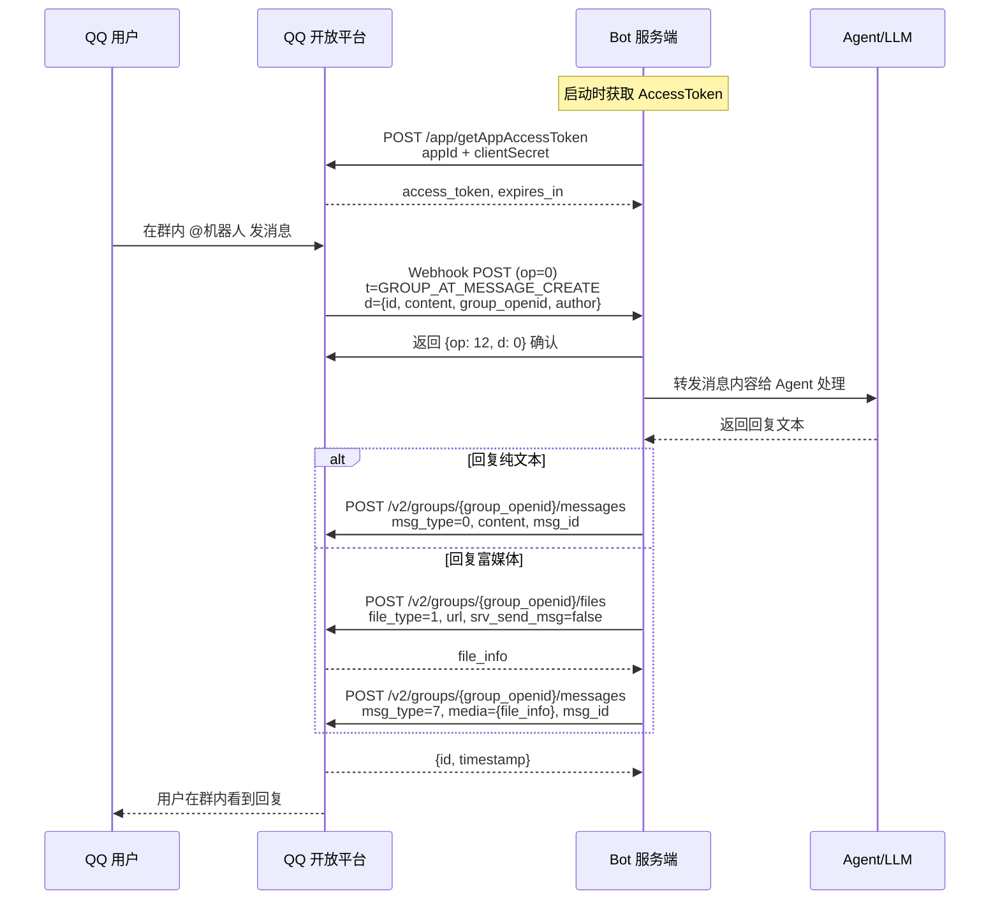

# QQ 开放平台机器人 API 通信协议规范

> 适用对象：实现 QQ 开放平台机器人消息收发的 SDK、网关和独立 Bot。
>
> 整理依据：QQ 开放平台官方文档（bot.q.qq.com/wiki）v2 API、已有 `chat-adapter-qq` 实现源码、社区 SDK（botpy、botgo、bot-node-sdk）实现经验。
>
> 说明：文中标注 "工程建议" 的内容来自现有客户端实现经验，用于提高兼容性；它们不是服务端返回字段本身的一部分。

## 1. 概述

QQ 开放平台机器人 API 是腾讯 QQ 机器人功能的 HTTP/JSON 协议。协议核心特征有四点：一是认证采用 `appId` + `clientSecret` 获取 `access_token`，鉴权头使用 `Authorization: QQBot {access_token}` 格式；二是消息发送覆盖四种场景 ——QQ 单聊（C2C）、QQ 群聊、文字子频道、频道私信（DMS）；三是消息接收支持 WebSocket 和 HTTP Webhook 回调两种模式，回调地址使用 Ed25519 签名验证；四是消息分为主动消息和被动回复，二者在频率限制和触发条件上差异显著。

**地址列表**

| 用途          | 地址                                        |
| ------------- | ------------------------------------------- |
| 认证服务      | `https://bots.qq.com/app/getAppAccessToken` |
| API 基座      | `https://api.sgroup.qq.com`                 |
| 沙箱 API 基座 | `https://sandbox.api.sgroup.qq.com`         |

## 2. 认证流程

### 2.1 获取 Access Token

**Method**

`POST`

**URL**

`https://bots.qq.com/app/getAppAccessToken`

**Headers**

| Header         | 是否必需 | 说明                      |
| -------------- | -------- | ------------------------- |
| `Content-Type` | 是       | 固定 `application/json`。 |

**Request Body**

```json
{
  "appId": "102012345",
  "clientSecret": "aBcDeFgHiJkLmNoPqRsTuVwXyZ123456"
}
```

字段说明：

| 字段           | 类型     | 是否必需 | 说明                                |
| -------------- | -------- | -------- | ----------------------------------- |
| `appId`        | `string` | 是       | 在 QQ 开放平台注册后获得的应用 ID。 |
| `clientSecret` | `string` | 是       | 对应的客户端密钥。                  |

**Response Body**

```json
{
  "access_token": "a]kLm4oPqRsT.uVwXyZ_1234567890ABCdEfGhIjK",
  "expires_in": "7200"
}
```

字段说明：

| 字段           | 类型     | 说明                                                             |
| -------------- | -------- | ---------------------------------------------------------------- |
| `access_token` | `string` | 访问令牌，后续所有业务 API 请求的鉴权凭证。                      |
| `expires_in`   | `string` | 有效期，单位秒。默认 7200 秒（2 小时）。注意此字段为字符串类型。 |

**curl 示例**

```bash
curl 'https://bots.qq.com/app/getAppAccessToken' \
  -X POST \
  -H 'Content-Type: application/json' \
  --data-raw '{
    "appId": "102012345",
    "clientSecret": "aBcDeFgHiJkLmNoPqRsTuVwXyZ123456"
  }'
```

**工程建议**

- `access_token` 默认 2 小时过期，不会自动刷新，需开发者手动在过期前重新获取。
- 在过期前 60 秒内获取新 token 时，新旧 token 在此 60 秒窗口内均有效，可实现平滑过渡。
- 建议提前 5 分钟刷新 token（即 `expires_in - 300` 秒后刷新），避免临界点竞态。
- `expires_in` 虽然语义是数字，实际返回为字符串，解析时注意类型转换。

### 2.2 认证头格式

所有业务 API 请求需携带以下认证头：

```
Authorization: QQBot {access_token}
```

注意前缀是 `QQBot`（不是 `Bearer`）。旧版 Token 鉴权方式（`Bot {token}`）已废弃，应使用 AccessToken 方式。

## 3. 公共请求规范

### 3.1 通用请求头

以下规范适用于所有业务 API 请求。

| Header          | 示例值                             | 是否必需 | 说明                                                              |
| --------------- | ---------------------------------- | -------- | ----------------------------------------------------------------- |
| `Content-Type`  | `application/json`                 | 是       | 所有业务接口发 JSON。频道消息接口额外支持 `multipart/form-data`。 |
| `Authorization` | `QQBot a]kLm4oPqRsT.uVwXyZ_123...` | 是       | AccessToken 鉴权。                                                |

### 3.2 基座地址

正式环境统一使用 `https://api.sgroup.qq.com`，拼接方式为 `{BASE_URL}{path}`。

沙箱环境使用 `https://sandbox.api.sgroup.qq.com`，接口路径不变。沙箱环境不受频率限制约束，适合调试。

### 3.3 通用响应格式

成功时 HTTP 状态码为 `200`（或 `201`、`204`），响应体为 JSON。

错误响应结构：

```json
{
  "code": 11241,
  "message": "invalid appid"
}
```

关键 HTTP 状态码：

| 状态码      | 含义           | 说明                             |
| ----------- | -------------- | -------------------------------- |
| `200`       | 成功           | 正常处理。                       |
| `201`/`202` | 异步成功       | 需要检查响应体判断是否真正成功。 |
| `204`       | 成功但无响应体 | 常见于删除操作。                 |
| `401`       | 认证失败       | Token 无效或过期。               |
| `404`       | 接口不存在     | 检查路径拼写。                   |
| `405`       | 方法不允许     | HTTP 方法错误。                  |
| `429`       | 频率限制       | 触发速率限制，需退避重试。       |
| `500`/`504` | 服务端错误     | 建议有限重试。                   |

## 4. 消息发送

QQ 机器人消息发送覆盖四种场景，接口路径和能力略有差异。所有消息接口都要求至少包含一个内容字段（`content`、`markdown`、`ark`、`embed`、`media`）。

### 4.1 消息类型枚举 `msg_type`

| 值  | 名称     | 说明                                                      |
| --- | -------- | --------------------------------------------------------- |
| `0` | TEXT     | 纯文本消息。对应 `content` 字段。                         |
| `2` | MARKDOWN | Markdown 消息。对应 `markdown` 字段。                     |
| `3` | ARK      | 模板消息（Ark 卡片）。对应 `ark` 字段。                   |
| `4` | EMBED    | 嵌入消息。对应 `embed` 字段。仅频道子频道和频道私信支持。 |
| `7` | MEDIA    | 富媒体消息（图片、视频、语音、文件）。对应 `media` 字段。 |

### 4.2 主动消息与被动回复

QQ 机器人消息分为两类：

**被动回复**：用户发消息或触发事件后，机器人在限定时间窗口内通过 `msg_id` 或 `event_id` 回复。

- 群聊被动回复窗口：5 分钟，每条用户消息最多回复 5 次。
- 单聊被动回复窗口：60 分钟，每条用户消息最多回复 5 次。
- 频道被动回复窗口：5 分钟。

**主动消息**：机器人在无用户触发的情况下主动下发。受严格频率限制。

- 单聊主动消息：每月每用户 4 条。
- 群聊主动消息：每月每群 4 条。
- 频道主动消息：每日每子频道 20 条，每日最多推送 2 个子频道。
- 频道私信主动消息：每日每用户 2 条，每日累计 200 条。

注意：2025 年 4 月 21 日起主动推送能力已下线。用户可在客户端关闭机器人的主动消息。

> **⚠ 重要限制：主动消息已不可用（2025 年 4 月起）**
>
> 自 2025 年 4 月 21 日起，QQ 开放平台已**全面下线**机器人主动消息能力。这意味着：
>
> 1. **所有消息必须是被动回复**：机器人只能在收到用户消息后，通过携带触发消息的 `msg_id` 进行回复。不携带 `msg_id` 的发送请求会被服务端以频率限制错误拒绝。
> 2. **message tool 的 `sendMessage` 操作无法可靠工作**：message tool 的执行上下文中不携带触发用户消息的 `msg_id`，因此无法构造合法的被动回复请求。即使 API 调用本身格式正确，也会因缺少 `msg_id` 被服务端拒绝。
> 3. **实际影响**：在服务适配器实现中，`sendMessage` 已被标记为不支持（`unsupported`）。所有需要主动发送消息的场景在 QQ 平台上均无法实现。

**工程建议**

- 优先使用被动回复模式，在收到事件后立即回复。
- 被动回复必须携带 `msg_id`（回复某条消息）或 `event_id`（回复某个事件），二选一。
- 主动消息不带 `msg_id` 和 `event_id`。
- HTTP 请求超时建议至少设置 5 秒。

### 4.3 消息去重机制

相同的 `msg_id` + `msg_seq` 组合会被服务端视为重复提交并拒绝。`msg_seq` 用于对同一条用户消息发送多条回复时的序号标识。

- 首条回复 `msg_seq` 可省略（默认 `1`）。
- 多条回复需递增 `msg_seq`：第 1 条为 `1`，第 2 条为 `2`，依此类推。
- 群聊和单聊场景使用 `msg_seq`；频道场景不使用。

### 4.4 发送群聊消息

**Method**

`POST`

**URL**

`https://api.sgroup.qq.com/v2/groups/{group_openid}/messages`

**路径参数**

| 参数           | 类型     | 说明                                                     |
| -------------- | -------- | -------------------------------------------------------- |
| `group_openid` | `string` | 群组的 openid，从 `GROUP_AT_MESSAGE_CREATE` 事件中获取。 |

**Request Body**

```json
{
  "content": "你好，这是一条群聊消息。",
  "msg_id": "xxxxxx",
  "msg_seq": 1,
  "msg_type": 0
}
```

字段说明：

| 字段       | 类型     | 是否必需 | 说明                                              |
| ---------- | -------- | -------- | ------------------------------------------------- |
| `content`  | `string` | 条件必需 | 文本内容。`msg_type=0` 时必填。                   |
| `msg_type` | `int`    | 是       | 消息类型，见第 4.1 节。                           |
| `markdown` | `object` | 条件必需 | Markdown 对象。`msg_type=2` 时必填。              |
| `ark`      | `object` | 条件必需 | Ark 模板对象。`msg_type=3` 时必填。               |
| `media`    | `object` | 条件必需 | 富媒体 `file_info` 对象。`msg_type=7` 时必填。    |
| `msg_id`   | `string` | 否       | 被动回复时填入触发消息的 ID。                     |
| `event_id` | `string` | 否       | 被动回复时填入触发事件的 ID。与 `msg_id` 二选一。 |
| `msg_seq`  | `int`    | 否       | 回复序号，默认 `1`。多条回复时递增。              |

**Response Body**

```json
{
  "id": "xxxxxx",
  "timestamp": "1677000000"
}
```

| 字段        | 类型     | 说明                  |
| ----------- | -------- | --------------------- |
| `id`        | `string` | 发送成功后的消息 ID。 |
| `timestamp` | `string` | 消息发送时间戳。      |

**curl 示例（被动回复文本）**

```bash
curl 'https://api.sgroup.qq.com/v2/groups/A1B2C3D4E5F6/messages' \
  -X POST \
  -H 'Content-Type: application/json' \
  -H 'Authorization: QQBot a]kLm4oPqRsT.uVwXyZ_1234567890ABCdEfGhIjK' \
  --data-raw '{
    "content": "你好，这是一条群聊消息。",
    "msg_type": 0,
    "msg_id": "08e09a8305ac3e5d141a1490",
    "msg_seq": 1
  }'
```

**curl 示例（被动回复 Markdown）**

```bash
curl 'https://api.sgroup.qq.com/v2/groups/A1B2C3D4E5F6/messages' \
  -X POST \
  -H 'Content-Type: application/json' \
  -H 'Authorization: QQBot a]kLm4oPqRsT.uVwXyZ_1234567890ABCdEfGhIjK' \
  --data-raw '{
    "msg_type": 2,
    "markdown": {
      "content": "# 标题\n这是一段 **Markdown** 内容。"
    },
    "msg_id": "08e09a8305ac3e5d141a1490",
    "msg_seq": 1
  }'
```

### 4.5 发送频道子频道消息

**Method**

`POST`

**URL**

`https://api.sgroup.qq.com/channels/{channel_id}/messages`

**路径参数**

| 参数         | 类型     | 说明                                                               |
| ------------ | -------- | ------------------------------------------------------------------ |
| `channel_id` | `string` | 子频道 ID，从 `AT_MESSAGE_CREATE` 或 `MESSAGE_CREATE` 事件中获取。 |

**Request Body**

```json
{
  "content": "你好，这是一条频道消息。",
  "msg_id": "xxxxxx"
}
```

字段说明：

| 字段                | 类型               | 是否必需 | 说明                                              |
| ------------------- | ------------------ | -------- | ------------------------------------------------- |
| `content`           | `string`           | 条件必需 | 文本内容，支持内嵌格式（@用户、# 子频道、表情）。 |
| `embed`             | `MessageEmbed`     | 条件必需 | 嵌入消息对象。                                    |
| `ark`               | `MessageArk`       | 条件必需 | Ark 模板对象。                                    |
| `markdown`          | `MessageMarkdown`  | 条件必需 | Markdown 对象。                                   |
| `image`             | `string`           | 条件必需 | 图片 URL，平台会自动转存。                        |
| `file_image`        | `file`             | 条件必需 | 图片文件，仅 `multipart/form-data` 格式时可用。   |
| `message_reference` | `MessageReference` | 否       | 引用消息对象。                                    |
| `msg_id`            | `string`           | 否       | 被动回复时填入触发消息 ID。                       |
| `event_id`          | `string`           | 否       | 被动回复时填入触发事件 ID。                       |

注意：`content`、`embed`、`ark`、`image`/`file_image`、`markdown` 至少需要提供一个。

**Response Body**

频道消息返回完整的 Message 对象：

```json
{
  "author": {
    "id": "11586990140073229091",
    "username": "mybot",
    "avatar": "https://thirdqq.qlogo.cn/g?...",
    "bot": true
  },
  "channel_id": "123456",
  "content": "你好，这是一条频道消息。",
  "guild_id": "789012",
  "id": "xxxxxx",
  "timestamp": "2026-03-22T04:25:12+08:00"
}
```

**curl 示例**

```bash
curl 'https://api.sgroup.qq.com/channels/123456/messages' \
  -X POST \
  -H 'Content-Type: application/json' \
  -H 'Authorization: QQBot a]kLm4oPqRsT.uVwXyZ_1234567890ABCdEfGhIjK' \
  --data-raw '{
    "content": "你好，这是一条频道消息。",
    "msg_id": "08e09a8305ac3e5d141a1490"
  }'
```

**频道消息审核**

频道消息可能触发内容审核，此时返回错误码 `304023` 或 `304024`，响应体包含 `audit_id` 字段。审核通过后消息会自动发出，审核不通过则不会发出。

### 4.6 发送单聊消息（C2C）

**Method**

`POST`

**URL**

`https://api.sgroup.qq.com/v2/users/{openid}/messages`

**路径参数**

| 参数     | 类型     | 说明                                                |
| -------- | -------- | --------------------------------------------------- |
| `openid` | `string` | 用户的 openid，从 `C2C_MESSAGE_CREATE` 事件中获取。 |

**Request Body**

```json
{
  "content": "你好，这是一条私聊消息。",
  "msg_id": "xxxxxx",
  "msg_seq": 1,
  "msg_type": 0
}
```

字段说明与群聊消息一致（见第 4.4 节），额外支持：

| 字段        | 类型   | 是否必需 | 说明                               |
| ----------- | ------ | -------- | ---------------------------------- |
| `is_wakeup` | `bool` | 否       | 互动召回消息标记，仅单聊场景支持。 |

**Response Body**

```json
{
  "id": "xxxxxx",
  "timestamp": "1677000000"
}
```

**curl 示例**

```bash
curl 'https://api.sgroup.qq.com/v2/users/F6A8B9C0D1E2/messages' \
  -X POST \
  -H 'Content-Type: application/json' \
  -H 'Authorization: QQBot a]kLm4oPqRsT.uVwXyZ_1234567890ABCdEfGhIjK' \
  --data-raw '{
    "content": "你好，这是一条私聊消息。",
    "msg_type": 0,
    "msg_id": "08e09a8305ac3e5d141a1490",
    "msg_seq": 1
  }'
```

**单聊互动召回消息**

用户主动对话后 30 天内，机器人可在以下四个阶段各下发 1 条互动召回消息：当天、1-3 天、3-7 天、7-30 天。发送时设置 `is_wakeup: true`。

### 4.7 发送频道私信消息（DMS）

频道私信需先通过 `POST /users/@me/dms` 创建私信会话获取 `guild_id`，然后发送消息。机器人与用户必须存在共同频道。

#### 4.7.1 创建私信会话

**Method**

`POST`

**URL**

`https://api.sgroup.qq.com/users/@me/dms`

**Request Body**

```json
{
  "recipient_id": "11586990140073229091",
  "source_guild_id": "789012"
}
```

| 字段              | 类型     | 是否必需 | 说明                                |
| ----------------- | -------- | -------- | ----------------------------------- |
| `recipient_id`    | `string` | 是       | 目标用户 ID。                       |
| `source_guild_id` | `string` | 是       | 源频道 ID，机器人与用户的共同频道。 |

**Response Body**

```json
{
  "channel_id": "xxxxxx",
  "create_time": "1677000000",
  "guild_id": "xxxxxx"
}
```

#### 4.7.2 发送私信消息

**Method**

`POST`

**URL**

`https://api.sgroup.qq.com/dms/{guild_id}/messages`

**路径参数**

| 参数       | 类型     | 说明                                                                       |
| ---------- | -------- | -------------------------------------------------------------------------- |
| `guild_id` | `string` | 创建私信会话返回的 `guild_id`，也可从 `DIRECT_MESSAGE_CREATE` 事件中获取。 |

**Request Body**

```json
{
  "content": "你好，这是一条频道私信。",
  "msg_id": "xxxxxx"
}
```

字段与频道消息一致（见第 4.5 节），支持 `content`、`embed`、`ark`、`markdown`、`image`、`message_reference`、`msg_id`、`event_id`。

**Response Body**

返回完整 Message 对象，结构与频道消息响应一致。

**curl 示例**

```bash
curl 'https://api.sgroup.qq.com/dms/DMS_GUILD_ID/messages' \
  -X POST \
  -H 'Content-Type: application/json' \
  -H 'Authorization: QQBot a]kLm4oPqRsT.uVwXyZ_1234567890ABCdEfGhIjK' \
  --data-raw '{
    "content": "你好，这是一条频道私信。",
    "msg_id": "08e09a8305ac3e5d141a1490"
  }'
```

### 4.8 文本长度限制与分片策略

协议没有在响应中显式下发 "最大文本长度" 字段。社区实现和已有代码普遍以 2000 个 Unicode 字符作为保守兼容上限。

**推荐分片算法**

1. 以 2000 个 Unicode 字符为上限。
2. 优先在 `\n\n`、其次在 `\n`、再次在空格处分片。
3. 找不到合适边界时，硬切 2000 字符，末尾附加 `...`。
4. 每个分片单独调用一次消息发送接口。
5. 多条回复递增 `msg_seq`，复用同一个 `msg_id`。

### 4.9 频率限制汇总

| 场景               | 类型       | 限制                                |
| ------------------ | ---------- | ----------------------------------- |
| 群聊被动回复       | 每条消息   | 5 分钟窗口，最多 5 条               |
| 群聊主动消息       | 每群每月   | 4 条                                |
| 单聊被动回复       | 每条消息   | 60 分钟窗口，最多 5 条              |
| 单聊主动消息       | 每用户每月 | 4 条                                |
| 频道子频道         | 全局       | 每秒每子频道 5 条                   |
| 频道子频道主动消息 | 每日       | 每子频道 20 条，每日最多 2 个子频道 |
| 频道被动回复       | 每条消息   | 5 分钟窗口                          |
| 频道私信主动消息   | 每日       | 每用户 2 条，累计 200 条            |
| 频道私信被动回复   | 每条消息   | 5 分钟窗口                          |

**工程建议**

- 沙箱环境不受上述频率限制约束。
- 被动回复场景下，应在收到用户消息后尽快回复，避免超时。
- 需要发送 WebSocket 连接才可以发送频道消息（频道 API 的前提要求）。

## 5. 获取机器人信息

### 5.1 接口定义

**Method**

`GET`

**URL**

`https://api.sgroup.qq.com/users/@me`

**Headers**

使用第 3 节的通用请求头。

**Request Body**

无。

**Response Body**

```json
{
  "avatar": "https://thirdqq.qlogo.cn/g?b=oidb&k=M5TibpXicS7Jt4z89BZxiamAA&s=100&t=1641802698",
  "id": "11586990140073229091",
  "union_openid": "74F138F7F3AF68C4B8E8325013FCA295",
  "union_user_account": "",
  "username": "gitsub"
}
```

字段说明：

| 字段                 | 类型     | 说明                                               |
| -------------------- | -------- | -------------------------------------------------- |
| `id`                 | `string` | 机器人用户 ID。                                    |
| `username`           | `string` | 机器人显示名称。                                   |
| `avatar`             | `string` | 头像 URL。                                         |
| `union_openid`       | `string` | 特约商户下的用户跨应用唯一标识（非特约商户为空）。 |
| `union_user_account` | `string` | 联合用户账号（可能为空）。                         |

**curl 示例**

```bash
curl 'https://api.sgroup.qq.com/users/@me' \
  -H 'Authorization: QQBot a]kLm4oPqRsT.uVwXyZ_1234567890ABCdEfGhIjK'
```

## 6. 消息数据结构

### 6.1 群聊 / 单聊消息事件载荷

群聊和单聊使用 v2 API 事件结构。

**`GROUP_AT_MESSAGE_CREATE` 事件 `d` 字段：**

```json
{
  "author": {
    "member_openid": "F6A8B9C0D1E2"
  },
  "content": "/help 查看帮助",
  "group_openid": "A1B2C3D4E5F6",
  "id": "08e09a8305ac3e5d141a1490",
  "timestamp": "2026-03-22T04:25:12+08:00"
}
```

| 字段                   | 类型     | 说明                                 |
| ---------------------- | -------- | ------------------------------------ |
| `id`                   | `string` | 消息 ID，用于被动回复时回传。        |
| `author.member_openid` | `string` | 发送者在群内的成员 openid。          |
| `content`              | `string` | 消息文本内容（@机器人 前缀已去除）。 |
| `group_openid`         | `string` | 群组 openid。                        |
| `timestamp`            | `string` | 消息创建时间，RFC 3339 格式。        |

**`C2C_MESSAGE_CREATE` 事件 `d` 字段：**

```json
{
  "attachments": [],
  "author": {
    "user_openid": "F6A8B9C0D1E2"
  },
  "content": "你好",
  "id": "08e09a8305ac3e5d141a1490",
  "timestamp": "2026-03-22T04:25:12+08:00"
}
```

| 字段                 | 类型     | 说明                                 |
| -------------------- | -------- | ------------------------------------ |
| `id`                 | `string` | 消息 ID。                            |
| `author.user_openid` | `string` | 发送者的 openid。                    |
| `content`            | `string` | 消息文本内容。                       |
| `timestamp`          | `string` | 消息创建时间。                       |
| `attachments`        | `array`  | 附件数组（图片、语音、视频、文件）。 |

### 6.2 频道消息事件载荷

频道消息使用 Message 对象结构。

**`AT_MESSAGE_CREATE` / `MESSAGE_CREATE` 事件 `d` 字段：**

```json
{
  "author": {
    "id": "11586990140073229091",
    "username": "testuser",
    "avatar": "https://...",
    "bot": false
  },
  "channel_id": "123456",
  "content": "<@!botid> 你好",
  "guild_id": "789012",
  "id": "xxxxxx",
  "member": {
    "joined_at": "2025-01-01T00:00:00+08:00",
    "roles": ["1"]
  },
  "mentions": [
    {
      "id": "botid",
      "username": "mybot",
      "avatar": "https://...",
      "bot": true
    }
  ],
  "seq": 123,
  "seq_in_channel": "456",
  "timestamp": "2026-03-22T04:25:12+08:00"
}
```

| 字段                | 类型     | 说明                                              |
| ------------------- | -------- | ------------------------------------------------- |
| `id`                | `string` | 消息 ID。                                         |
| `channel_id`        | `string` | 子频道 ID。                                       |
| `guild_id`          | `string` | 频道 ID。                                         |
| `content`           | `string` | 消息内容，@ 使用 `<@!userid>` 格式。              |
| `timestamp`         | `string` | 消息创建时间，RFC 3339 格式。                     |
| `author`            | `object` | 发送者信息（id、username、avatar、bot）。         |
| `member`            | `object` | 成员信息（joined_at、roles）。                    |
| `mentions`          | `array`  | 被 @ 的用户数组。                                 |
| `seq`               | `number` | 消息序列号，用于排序。                            |
| `seq_in_channel`    | `string` | 频道内序列号。                                    |
| `attachments`       | `array`  | 附件数组（包含 url、content_type、filename 等）。 |
| `message_reference` | `object` | 引用消息对象（包含 `message_id`）。               |

### 6.3 附件结构 `Attachment`

```json
{
  "content_type": "image/png",
  "filename": "image.png",
  "height": 600,
  "size": 248736,
  "url": "https://multimedia.nt.qq.com.cn/xxx",
  "width": 800
}
```

| 字段           | 类型      | 说明              |
| -------------- | --------- | ----------------- |
| `url`          | `string`  | 附件下载 URL。    |
| `content_type` | `string`  | MIME 类型。       |
| `filename`     | `string`  | 文件名。          |
| `height`       | `number?` | 图片 / 视频高度。 |
| `width`        | `number?` | 图片 / 视频宽度。 |
| `size`         | `number`  | 文件大小，字节。  |

## 7. 消息类型详解

### 7.1 TEXT（msg_type = 0）

最简单的消息类型，直接在 `content` 字段填入文本内容。

```json
{
  "content": "你好，世界！",
  "msg_id": "08e09a8305ac3e5d141a1490",
  "msg_type": 0
}
```

频道消息中的 `content` 支持内嵌格式：

| 格式            | 说明       | 示例                       |
| --------------- | ---------- | -------------------------- |
| `<@!user_id>`   | @某用户    | `<@!11586990140073229091>` |
| `<#channel_id>` | 引用子频道 | `<#123456>`                |
| `<emoji:id>`    | 表情       | `<emoji:4>`                |

### 7.2 MARKDOWN（msg_type = 2）

Markdown 消息有两种使用方式：

**方式一：自定义 Markdown（原生内容）**

```json
{
  "markdown": {
    "content": "# 标题\n## 简介\n这是一段 **加粗** 和 *斜体* 的文本。\n- 列表项 1\n- 列表项 2"
  },
  "msg_id": "08e09a8305ac3e5d141a1490",
  "msg_type": 2
}
```

**方式二：模板 Markdown**

```json
{
  "markdown": {
    "custom_template_id": "template_id_12345",
    "params": [
      { "key": "title", "values": ["我的标题"] },
      { "key": "content", "values": ["正文内容"] }
    ]
  },
  "msg_id": "08e09a8305ac3e5d141a1490",
  "msg_type": 2
}
```

`MessageMarkdown` 结构：

| 字段                 | 类型      | 说明                                                 |
| -------------------- | --------- | ---------------------------------------------------- |
| `content`            | `string?` | 原生 Markdown 文本。与 `custom_template_id` 二选一。 |
| `custom_template_id` | `string?` | 模板 ID，在平台申请后获得。                          |
| `params`             | `array?`  | 模板变量的键值映射数组，每项包含 `key` 和 `values`。 |

支持的 Markdown 语法：

| 语法                              | 说明                     |
| --------------------------------- | ------------------------ |
| `#`、`##`                         | 标题                     |
| `**text**`                        | 加粗                     |
| `__text__`                        | 下划线加粗               |
| `_text_`、`*text*`                | 斜体                     |
| `~~text~~`                        | 删除线                   |
| `[text](url)`                     | 链接                     |
| `` | 图片（需公网可访问 URL） |
| `1.`、`-`                         | 有序 / 无序列表          |
| `>`                               | 引用                     |
| `***`                             | 分割线                   |

**工程建议**

- 自定义 Markdown 在沙箱环境可直接使用；正式环境需要邀请开通。
- 开通模板 MD 或原生 MD 后，主动 MD 默认生效，被动 MD 仍需单独申请。
- Markdown 内的图片资源必须使用公网可访问的 URL。

### 7.3 ARK（msg_type = 3）

Ark 是 QQ 机器人的模板卡片消息。平台默认提供三个模板：

| 模板 ID | 说明                |
| ------- | ------------------- |
| `23`    | 链接 + 文本列表布局 |
| `24`    | 文本 + 缩略图布局   |
| `37`    | 大图布局            |

`MessageArk` 结构：

| 字段          | 类型    | 说明                 |
| ------------- | ------- | -------------------- |
| `template_id` | `int`   | 模板 ID。            |
| `kv`          | `array` | 模板变量键值对数组。 |

`kv` 数组元素结构：

| 字段    | 类型      | 说明                                                      |
| ------- | --------- | --------------------------------------------------------- |
| `key`   | `string`  | 变量名，通常以 `#` 包围（如 `#DESC#`）。                  |
| `value` | `string?` | 变量值（简单类型）。                                      |
| `obj`   | `array?`  | 变量值（数组类型），元素为 `{ obj_kv: [{key, value}] }`。 |

```json
{
  "ark": {
    "template_id": 23,
    "kv": [
      { "key": "#DESC#", "value": "描述信息" },
      { "key": "#PROMPT#", "value": "通知摘要" },
      {
        "key": "#LIST#",
        "obj": [
          { "obj_kv": [{ "key": "desc", "value": "项目 1" }] },
          { "obj_kv": [{ "key": "desc", "value": "项目 2" }] }
        ]
      }
    ]
  },
  "msg_id": "08e09a8305ac3e5d141a1490",
  "msg_type": 3
}
```

**工程建议**

- 主动 Ark 消息默认可用，被动 Ark 消息需要达到准入条件并向平台申请。
- 自定义 Ark 模板需在管理后台申请。

### 7.4 EMBED（msg_type = 4）

Embed 是一种特殊的 Ark 消息，仅在**频道子频道**和**频道私信**场景下可用。群聊和单聊不支持。

`MessageEmbed` 结构：

| 字段        | 类型      | 说明                               |
| ----------- | --------- | ---------------------------------- |
| `title`     | `string`  | 标题。                             |
| `prompt`    | `string`  | 消息通知文本（展示在推送通知中）。 |
| `thumbnail` | `object?` | 缩略图对象，包含 `url` 字段。      |
| `fields`    | `array`   | 内容项数组，每项包含 `name` 字段。 |

```json
{
  "embed": {
    "title": "等级通知",
    "prompt": "你的等级已更新",
    "thumbnail": { "url": "https://example.com/thumb.png" },
    "fields": [{ "name": "当前等级：黄金" }, { "name": "之前等级：白银" }, { "name": "继续努力" }]
  },
  "msg_id": "08e09a8305ac3e5d141a1490"
}
```

### 7.5 MEDIA（msg_type = 7）

富媒体消息（图片、视频、语音、文件）需要先上传到 QQ 服务器获取 `file_info`，再在发送消息时通过 `media` 字段引用。

#### 上传接口

| 场景 | 接口                                   |
| ---- | -------------------------------------- |
| 单聊 | `POST /v2/users/{openid}/files`        |
| 群聊 | `POST /v2/groups/{group_openid}/files` |

**Request Body**

```json
{
  "file_type": 1,
  "srv_send_msg": false,
  "url": "https://example.com/image.png"
}
```

| 字段           | 类型      | 是否必需 | 说明                                                                                                  |
| -------------- | --------- | -------- | ----------------------------------------------------------------------------------------------------- |
| `file_type`    | `int`     | 是       | `1` = 图片（png/jpg），`2` = 视频（mp4），`3` = 语音（silk/wav/mp3/flac），`4` = 文件（群聊不可用）。 |
| `url`          | `string`  | 是       | 媒体资源的公网 URL。                                                                                  |
| `srv_send_msg` | `bool`    | 是       | `true` = 上传并直接发送（消耗主动消息配额）；`false` = 仅上传，返回 `file_info` 供后续引用。          |
| `file_data`    | `string?` | 否       | base64 编码的文件二进制数据（替代 URL 方式）。                                                        |

**Response Body**

```json
{
  "file_info": "xxxxxx",
  "file_uuid": "xxxxxx",
  "id": "xxxxxx",
  "ttl": 259200
}
```

| 字段        | 类型      | 说明                                       |
| ----------- | --------- | ------------------------------------------ |
| `file_uuid` | `string`  | 文件唯一标识符。                           |
| `file_info` | `string`  | 用于消息发送的文件引用信息。               |
| `ttl`       | `int`     | 文件有效期，秒。`0` 表示长期可用。         |
| `id`        | `string?` | 消息 ID（仅 `srv_send_msg=true` 时返回）。 |

#### 引用上传文件发送消息

```json
{
  "media": {
    "file_info": "xxxxxx"
  },
  "msg_id": "08e09a8305ac3e5d141a1490",
  "msg_seq": 1,
  "msg_type": 7
}
```

**curl 示例（上传图片）**

```bash
curl 'https://api.sgroup.qq.com/v2/groups/A1B2C3D4E5F6/files' \
  -X POST \
  -H 'Content-Type: application/json' \
  -H 'Authorization: QQBot a]kLm4oPqRsT.uVwXyZ_1234567890ABCdEfGhIjK' \
  --data-raw '{
    "file_type": 1,
    "url": "https://example.com/image.png",
    "srv_send_msg": false
  }'
```

**curl 示例（发送已上传的图片）**

```bash
curl 'https://api.sgroup.qq.com/v2/groups/A1B2C3D4E5F6/messages' \
  -X POST \
  -H 'Content-Type: application/json' \
  -H 'Authorization: QQBot a]kLm4oPqRsT.uVwXyZ_1234567890ABCdEfGhIjK' \
  --data-raw '{
    "msg_type": 7,
    "media": {
      "file_info": "xxxxxx"
    },
    "msg_id": "08e09a8305ac3e5d141a1490",
    "msg_seq": 1
  }'
```

**工程建议**

- 通过 `/v2/users/{openid}/files` 上传的文件只能发到单聊，通过 `/v2/groups/{group_openid}/files` 上传的文件只能发到群聊。不可跨场景使用。
- 单个 `file_info` 可复用于多个接收者。
- 开发者需自行管理 `file_info` 的过期时间（根据 `ttl` 字段）。
- 推荐设置 `srv_send_msg=false`，先获取 `file_info`，再通过消息发送接口发送。
- 频道消息的图片可直接通过 `image` 字段传入 URL，由平台自动转存，无需单独上传。

### 7.6 引用消息 `MessageReference`

仅频道子频道和频道私信支持。

```json
{
  "message_reference": {
    "message_id": "xxxxxx",
    "ignore_get_message_error": true
  }
}
```

| 字段                       | 类型     | 说明                                         |
| -------------------------- | -------- | -------------------------------------------- |
| `message_id`               | `string` | 被引用的消息 ID。                            |
| `ignore_get_message_error` | `bool?`  | 是否忽略引用消息获取失败错误，默认 `false`。 |

## 8. Webhook 事件接收

### 8.1 通信载荷结构

所有 Webhook 和 WebSocket 消息使用统一格式：

```json
{
  "d": {},
  "id": "event_id_xxx",
  "op": 0,
  "s": 42,
  "t": "GROUP_AT_MESSAGE_CREATE"
}
```

| 字段 | 类型      | 说明                             |
| ---- | --------- | -------------------------------- |
| `id` | `string`  | 事件标识符。                     |
| `op` | `int`     | 操作码，见下表。                 |
| `d`  | `object`  | 事件数据，结构随事件类型变化。   |
| `s`  | `number?` | 序列号，用于消息唯一性判断。     |
| `t`  | `string?` | 事件类型名称，仅 `op=0` 时存在。 |

### 8.2 操作码 OpCode

| 代码 | 名称              | 方向             | 说明               |
| ---- | ----------------- | ---------------- | ------------------ |
| `0`  | DISPATCH          | 服务端 -> 客户端 | 事件推送。         |
| `12` | HTTP_CALLBACK_ACK | 客户端 -> 服务端 | 确认收到事件回调。 |
| `13` | CALLBACK_VERIFY   | 服务端 -> 客户端 | 回调地址验证请求。 |

### 8.3 回调地址验证（op = 13）

配置 Webhook 回调地址时，平台会发送验证请求。

**请求 Headers**

| Header        | 说明             |
| ------------- | ---------------- |
| `User-Agent`  | `QQBot-Callback` |
| `X-Bot-Appid` | 机器人 appId     |

**请求 Body**

```json
{
  "d": {
    "plain_token": "xxxxxx",
    "event_ts": "1677000000"
  },
  "op": 13
}
```

**响应 Body**

机器人服务端需返回：

```json
{
  "plain_token": "xxxxxx",
  "signature": "hex_encoded_ed25519_signature"
}
```

签名计算过程：

1. 将 Bot Secret 字符串重复填充至 32 字节（Ed25519 seed 长度）。
2. 用该 seed 生成 Ed25519 密钥对。
3. 拼接签名体：`event_ts + plain_token`。
4. 用私钥签名，结果转十六进制编码。

**工程建议**

- 回调地址仅支持 80、443、8080、8443 端口。
- 必须使用 HTTPS。
- 验证请求的 `plain_token` 需原样返回。

### 8.4 事件签名验证

接收到事件推送后，应验证请求签名：

1. 从 HTTP Header 获取 `X-Signature-Ed25519`（十六进制编码的签名）。
2. 从 HTTP Header 获取 `X-Signature-Timestamp`（时间戳）。
3. 拼接签名体：`X-Signature-Timestamp + HTTP Body`。
4. 用步骤 8.3 中生成的公钥调用 `ed25519.Verify` 验证签名。

### 8.5 事件回调确认

收到事件后，机器人服务端应返回：

```json
{
  "d": 0,
  "op": 12
}
```

HTTP 状态码 `200`。

### 8.6 事件类型

| 事件类型                  | Intent                            | 说明                           |
| ------------------------- | --------------------------------- | ------------------------------ |
| `C2C_MESSAGE_CREATE`      | `GROUP_AND_C2C_EVENT` (1 << 25)   | 用户单聊消息。                 |
| `GROUP_AT_MESSAGE_CREATE` | `GROUP_AND_C2C_EVENT` (1 << 25)   | 用户在群内 @机器人。           |
| `AT_MESSAGE_CREATE`       | `PUBLIC_GUILD_MESSAGES` (1 << 30) | 频道内 @机器人（公域）。       |
| `MESSAGE_CREATE`          | `GUILD_MESSAGES` (1 << 9)         | 频道全量消息（私域，需权限）。 |
| `DIRECT_MESSAGE_CREATE`   | `DIRECT_MESSAGE` (1 << 12)        | 频道私信消息。                 |

**Intent 计算**

多个事件组合使用按位或：

```
intents = (1 << 25) | (1 << 30) | (1 << 12)
```

**工程建议**

- 为保证消息送达，平台可能重复推送相同消息 ID 的事件。开发者应基于消息 ID 做去重，避免重复回复。
- `GROUP_AND_C2C_EVENT` (1 << 25) 是群聊和单聊场景的 Intent。
- `PUBLIC_GUILD_MESSAGES` (1 << 30) 是公域频道 @机器人 的 Intent。
- `GUILD_MESSAGES` (1 << 9) 需要私域权限，一般不使用。
- 未授权的 Intent 会导致连接被断开。

## 9. Ed25519 签名算法

### 9.1 Seed 派生

将 Bot Secret 重复拼接直到达到 32 字节：

```text
secret   = "naOC0ocQE3shWLAfffVLB1rhYPG7"    (28 字节)
seed     = "naOC0ocQE3shWLAfffVLB1rhYPG7naOC"  (32 字节)
```

### 9.2 TypeScript 实现示例

```ts
import crypto from 'node:crypto';

function deriveEd25519Seed(secret: string): Buffer {
  const seed = Buffer.alloc(32);
  const secretBuf = Buffer.from(secret, 'utf8');
  for (let i = 0; i < 32; i++) {
    seed[i] = secretBuf[i % secretBuf.length];
  }
  return seed;
}

function signCallback(secret: string, eventTs: string, plainToken: string): string {
  const seed = deriveEd25519Seed(secret);
  const keyPair = crypto.sign(null, Buffer.from(eventTs + plainToken), {
    key: crypto.createPrivateKey({
      format: 'der',
      type: 'pkcs8',
      // Ed25519 PKCS8 DER prefix + seed
      key: Buffer.concat([Buffer.from('302e020100300506032b657004220420', 'hex'), seed]),
    }),
  });
  return keyPair.toString('hex');
}
```

## 10. 错误码参考表

### 10.1 HTTP 层

| 状态码      | 含义         | 处理建议                   |
| ----------- | ------------ | -------------------------- |
| `200`       | 成功         | 正常处理。                 |
| `201`/`202` | 异步成功     | 检查响应体。               |
| `204`       | 成功无响应体 | 常见于删除操作。           |
| `401`       | 认证失败     | 检查 Token，可能需要刷新。 |
| `404`       | 接口不存在   | 检查 URL 拼写。            |
| `405`       | 方法不允许   | 检查 HTTP 方法。           |
| `429`       | 频率限制     | 退避重试。                 |
| `500`/`504` | 服务端错误   | 有限重试，建议最多 3 次。  |

### 10.2 业务层

| 错误码范围        | 类别     | 说明                                                           |
| ----------------- | -------- | -------------------------------------------------------------- |
| `10001-11275`     | 账号认证 | appId 无效、Token 校验失败等。Token 校验失败一般重试一次即可。 |
| `20028`           | 消息限频 | 超出频率限制。                                                 |
| `50006`           | 消息为空 | 消息体缺少有效内容。                                           |
| `50045`           | 回复限制 | 不允许回复机器人自己的消息。                                   |
| `301000-610014`   | 频道权限 | 无效频道 / 子频道 ID、权限不足等。                             |
| `304023`/`304024` | 内容审核 | 消息进入审核，响应包含 `audit_id`。                            |
| `620001-639999`   | 安全过滤 | 内容包含敏感信息。                                             |
| `1100100-1100499` | 内容违规 | 敏感内容检测（如 `1100101` 表示 "内容涉及敏感"）。             |
| `3000000-3999999` | 消息编辑 | 编辑限制（如不能修改非机器人消息）。                           |

**工程建议**

- 认证失败（`401` 或 `10001` 系列）应触发 Token 刷新，然后重试。
- 频率限制（`429` 或 `20028`）应按指数退避策略重试。
- 内容审核（`304023`/`304024`）不应重试，等待审核结果即可。
- URL 包含的消息需在管理后台预先配置白名单，否则可能被拦截。

## 11. 完整消息流程图



## 12. 附录：与其他平台对比

| 维度           | Telegram Bot API            | 微信 iLink Bot API             | QQ 开放平台 Bot API                                       |
| -------------- | --------------------------- | ------------------------------ | --------------------------------------------------------- |
| 收消息方式     | `getUpdates` 或 Webhook     | `getupdates` 长轮询            | WebSocket 或 HTTP Webhook                                 |
| 发送目标       | `chat_id`                   | `to_user_id` + `context_token` | `group_openid` / `openid` / `channel_id` / DMS `guild_id` |
| 对话关联主键   | `chat_id` 足够              | `context_token` 是关键         | 路径参数中的 openid/channel_id 即可                       |
| 主动发消息能力 | 只要知道 `chat_id` 通常即可 | 依赖最近入站 `context_token`   | 有严格月度 / 日度配额限制                                 |
| 被动回复窗口   | 无限制                      | 无明确公开限制                 | 群聊 5 分钟 / 单聊 60 分钟                                |
| 消息去重       | `message_id` 自动处理       | `client_id` 避免重复           | `msg_id` + `msg_seq` 去重                                 |
| 媒体上传       | multipart/form-data         | AES-128-ECB + CDN 上传         | URL 转存或 base64 上传，返回 `file_info`                  |
| 认证方式       | Bot Token（永久）           | 二维码扫码获取 Bot Token       | appId + clientSecret 获取 AccessToken（2h 过期）          |
| 签名验证       | 无                          | 无                             | Ed25519 签名                                              |
| 内容审核       | 无强制                      | 无公开审核                     | 平台内置审核，可能返回 `audit_id`                         |

总结：QQ 开放平台的消息模型比 Telegram 更受限（主动消息有配额、被动回复有时间窗口），但比微信 iLink 更标准化（不需要维护 `context_token`，使用标准 RESTful 路径参数寻址）。签名验证使用 Ed25519 算法，是三者中安全机制最完整的。开发者应优先使用被动回复模式，合理管理 AccessToken 生命周期，并在消息发送时正确设置 `msg_id` + `msg_seq` 以避免去重拒绝。

## 13. 实测验证记录

> 本节记录 message tool 服务适配器（`QQMessageService`）与 QQ 开放平台 API 的对接验证情况。

### 13.1 验证方式

QQ API 通过代码审查与官方文档对照进行验证，确认各接口的请求 / 响应格式与官方规范一致。

### 13.2 关键发现

| 发现                 | 说明                                                                                                                                                                                                                |
| -------------------- | ------------------------------------------------------------------------------------------------------------------------------------------------------------------------------------------------------------------- |
| `sendMessage` 不可用 | 自 2025 年 4 月起，QQ 已下线主动消息能力。所有消息必须作为被动回复发送，需携带触发用户消息的 `msg_id`。message tool 的执行上下文不携带 `msg_id`，因此 `sendMessage` 在服务适配器中被标记为不支持（`unsupported`）。 |
| API 能力极度受限     | QQ 开放平台仅提供消息发送相关 API，不提供消息历史读取、消息编辑、消息删除、表情回复、频道信息查询、成员信息查询等能力。这使得 message tool 的 17 项操作中几乎全部无法实现。                                         |
| `channelId` 格式约定 | 服务适配器使用 `"type:id"` 格式编码 channelId，以区分不同的消息场景。例如：`"group:A1B2C3D4E5F6"`（群聊）、`"guild:789012"`（频道）、`"c2c:F6A8B9C0D1E2"`（单聊）、`"dms:DMS_GUILD_ID"`（频道私信）。               |

### 13.3 服务适配器操作支持情况

服务适配器支持 **0 / 17** 项 message tool 操作（`sendMessage` 因缺少 `msg_id` 上下文而标记为不支持）：

| 操作                | 支持 | 原因                                                 |
| ------------------- | ---- | ---------------------------------------------------- |
| `sendMessage`       | No   | 需要 `msg_id` 进行被动回复，tool 上下文不提供        |
| `readMessages`      | No   | QQ API 无消息历史读取接口                            |
| `editMessage`       | No   | QQ API 无消息编辑接口                                |
| `deleteMessage`     | No   | QQ API 无消息撤回接口（仅频道有撤回，群聊 / 单聊无） |
| `reactToMessage`    | No   | QQ API 无表情回复接口（仅频道有表情表态）            |
| `getChannelInfo`    | No   | QQ API 无通用频道信息查询接口                        |
| `getMemberInfo`     | No   | QQ API 无成员信息查询接口                            |
| `replyToThread`     | No   | QQ API 无话题回复机制                                |
| `searchMessages`    | No   | QQ API 无消息搜索接口                                |
| `getReactions`      | No   | QQ API 无表情回复查询接口                            |
| `pinMessage`        | No   | QQ API 无消息置顶接口（仅频道有）                    |
| `unpinMessage`      | No   | QQ API 无取消置顶接口                                |
| `getPinnedMessages` | No   | QQ API 无置顶消息查询接口                            |
| `listChannels`      | No   | QQ API 无通用频道列表接口                            |
| `createThread`      | No   | QQ API 无话题创建接口                                |
| `listThreads`       | No   | QQ API 无话题列表接口                                |
| `createPoll`        | No   | QQ API 无投票接口                                    |
