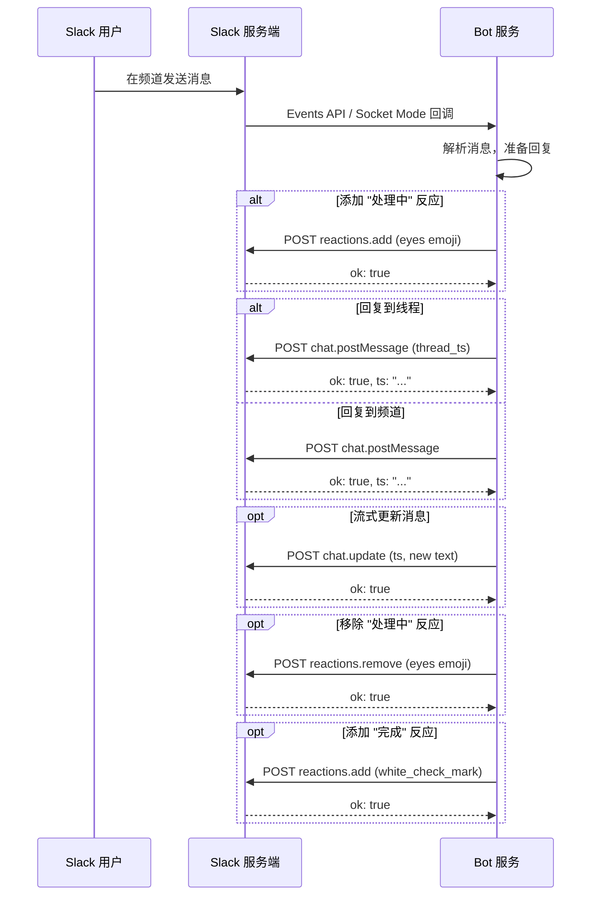

# Slack Web API 通信协议规范

> 适用对象：实现 Slack Bot 消息操作的 SDK、网关和独立 Bot。
>
> 整理依据：Slack 官方文档 `docs.slack.dev`、仓库 `api.ts` 中 `SlackApi` 类的实际调用、Slack Web API 公开规范。
>
> 说明：文中标注 "工程建议" 的内容来自现有客户端实现经验，用于提高兼容性；它们不是服务端返回字段本身的一部分。

## 1. 概述

Slack Web API 是 Slack 平台的 HTTP/JSON 接口。所有方法的基座地址统一为 `https://slack.com/api/{method}`。协议核心特征有三点：一是所有接口均使用 Bearer Token 认证；二是所有写操作（发消息、更新、删除、添加反应等）统一使用 `POST` 方法，读操作（查询历史、获取信息等）使用 `GET` 方法；三是每条消息由 `channel` + `ts`（时间戳）唯一标识，所有针对已有消息的操作都依赖这一对组合键。

## 2. 认证与公共请求规范

### 2.1 认证方式

Slack Web API 使用 OAuth Bearer Token 认证。Token 通过 HTTP `Authorization` 头传递。

**请求头**

| Header          | 示例值                                             | 是否必需 | 说明                                                 |
| --------------- | -------------------------------------------------- | -------- | ---------------------------------------------------- |
| `Authorization` | `Bearer $SLACK_BOT_TOKEN`                          | 是       | Bot User OAuth Token，以 `xoxb-` 开头。              |
| `Content-Type`  | `application/x-www-form-urlencoded; charset=utf-8` | 是       | POST 请求统一使用 form-urlencoded 格式，兼容性最佳。 |

> **工程说明（Content-Type 选择）**：Slack 官方文档称 `application/json` 适用于大多数 POST 方法，但实测发现部分方法（如 `conversations.info`、`reactions.get`）在使用 JSON Content-Type 时会忽略 body 参数导致请求失败。而 `application/x-www-form-urlencoded` 是 Slack Web API 所有方法均支持的格式，兼容性远优于 JSON。因此本规范统一推荐使用 `application/x-www-form-urlencoded; charset=utf-8` 作为 POST 请求的 Content-Type，以避免跨方法的兼容性问题。

**Token 类型**

| 前缀    | 类型             | 说明                                               |
| ------- | ---------------- | -------------------------------------------------- |
| `xoxb-` | Bot User Token   | Bot 级别令牌，适用于大多数操作。                   |
| `xoxp-` | User OAuth Token | 用户级别令牌，`search.messages` 等方法要求此类型。 |
| `xoxe-` | Enterprise Token | 企业级令牌，Enterprise Grid 部署中使用。           |

### 2.2 通用响应结构

所有 Slack Web API 响应均包含 `ok` 布尔字段，指示操作是否成功。

**成功响应**

```json
{
  "ok": true,
  ...
}
```

**失败响应**

```json
{
  "error": "channel_not_found",
  "ok": false
}
```

### 2.3 速率限制

Slack 按方法、按工作空间评估速率限制，分四个等级：

| 等级   | 频率上限       | 说明                                                  |
| ------ | -------------- | ----------------------------------------------------- |
| Tier 1 | 1+ 次 / 分钟   | 极低频方法。                                          |
| Tier 2 | 20+ 次 / 分钟  | 大多数写操作。                                        |
| Tier 3 | 50+ 次 / 分钟  | 集合类查询方法。                                      |
| Tier 4 | 100+ 次 / 分钟 | 高频查询方法。                                        |
| 特殊   | 视方法而定     | `chat.postMessage` 为每频道 1 次 / 秒，允许短暂突发。 |

超过限制时，Slack 返回 HTTP `429 Too Many Requests`，响应头 `Retry-After` 指定等待秒数。

**工程建议**

- 以 1 次 / 秒为基准设计调用频率，允许临时突发但不要依赖未公开的突发容量。
- 使用 `Retry-After` 头实现指数退避重试。
- 429 只影响当前方法和工作空间，不影响其他方法或工作空间。
- 2025 年 5 月起，非 Marketplace 的商业分发应用对 `conversations.history` 和 `conversations.replies` 限制为每分钟 1 次，最大 limit 降至 15。

### 2.4 常见错误码

| 错误码                | 含义                      | 处理建议                        |
| --------------------- | ------------------------- | ------------------------------- |
| `not_authed`          | 未提供有效 Token。        | 检查 Authorization 头。         |
| `invalid_auth`        | Token 无效或已过期。      | 重新获取 Token。                |
| `token_revoked`       | Token 已被撤销。          | 重新授权。                      |
| `channel_not_found`   | 频道不存在或 Bot 无权限。 | 确认频道 ID 和 Bot 的频道权限。 |
| `message_not_found`   | 消息不存在。              | 确认 ts 和 channel 组合。       |
| `cant_update_message` | 无法更新该消息。          | 只能更新自己发送的消息。        |
| `cant_delete_message` | 无法删除该消息。          | 只能删除 Bot 自己发送的消息。   |
| `already_reacted`     | 已添加过相同 reaction。   | 忽略或先检查再添加。            |
| `no_reaction`         | 该 reaction 不存在。      | 忽略或先检查再移除。            |
| `too_many_pins`       | 频道 pin 数量达到上限。   | 先取消旧 pin。                  |
| `not_pinnable`        | 该消息类型不可被 pin。    | 不要 pin 系统消息、文件评论等。 |
| `missing_scope`       | Token 缺少所需 scope。    | 重新配置 OAuth scope。          |
| `ratelimited`         | 触发速率限制。            | 读取 Retry-After 头后重试。     |

## 3. 消息操作

### 3.1 chat.postMessage — 发送消息

**Method**

`POST`

**URL**

`https://slack.com/api/chat.postMessage`

**所需权限**

- Bot Token Scope：`chat:write`
- 发送到未加入的公共频道：额外需要 `chat:write.public`
- 自定义用户名 / 图标：额外需要 `chat:write.customize`

**速率限制**

特殊：每频道 1 次 / 秒，短暂突发允许；工作空间级别每分钟数百条消息。

**请求参数**

| 参数              | 类型      | 是否必需 | 说明                                                                   |
| ----------------- | --------- | -------- | ---------------------------------------------------------------------- |
| `channel`         | `string`  | 是       | 目标频道 ID、私有群组 ID 或 IM 频道 ID。                               |
| `text`            | `string`  | 条件必需 | 消息正文；使用 `blocks` 时作为无障碍回退文本。上限 40,000 字符。       |
| `thread_ts`       | `string`  | 否       | 父消息的时间戳，用于创建线程回复。                                     |
| `blocks`          | `array`   | 否       | Block Kit 结构化消息块数组。                                           |
| `attachments`     | `array`   | 否       | 附件数组，单条消息最多 100 个附件。                                    |
| `mrkdwn`          | `boolean` | 否       | 是否启用 mrkdwn 格式解析，默认 `true`。                                |
| `reply_broadcast` | `boolean` | 否       | 配合 `thread_ts` 使用，使线程回复在频道主视图可见。                    |
| `unfurl_links`    | `boolean` | 否       | 是否展开文本链接预览。                                                 |
| `unfurl_media`    | `boolean` | 否       | 是否展开媒体链接预览。                                                 |
| `metadata`        | `object`  | 否       | 事件元数据，包含 `event_type` 和 `event_payload`。                     |
| `parse`           | `string`  | 否       | 消息格式化行为调整。                                                   |
| `icon_emoji`      | `string`  | 否       | 自定义消息图标 emoji，如 `:robot_face:`。                              |
| `icon_url`        | `string`  | 否       | 自定义消息图标 URL。                                                   |
| `username`        | `string`  | 否       | 自定义发送者显示名称。                                                 |
| `markdown_text`   | `string`  | 否       | Markdown 格式文本，上限 12,000 字符；与 `blocks`/`text` 不可同时使用。 |

**响应结构**

```json
{
  "channel": "C0123ABCDEF",
  "message": {
    "text": "Hello, world!",
    "type": "message",
    "subtype": "bot_message",
    "ts": "1503435956.000247"
  },
  "ok": true,
  "ts": "1503435956.000247"
}
```

| 字段      | 类型      | 说明                             |
| --------- | --------- | -------------------------------- |
| `ok`      | `boolean` | 是否成功。                       |
| `channel` | `string`  | 消息所在频道 ID。                |
| `ts`      | `string`  | 消息时间戳，是该消息的唯一标识。 |
| `message` | `object`  | 消息对象。                       |

**curl 示例 — 发送普通消息**

```bash
curl 'https://slack.com/api/chat.postMessage' \
  -X POST \
  -H 'Content-Type: application/x-www-form-urlencoded; charset=utf-8' \
  -H 'Authorization: Bearer $SLACK_BOT_TOKEN' \
  -d 'channel=C0123ABCDEF&text=Hello%2C+world!'
```

**curl 示例 — 发送线程回复**

```bash
curl 'https://slack.com/api/chat.postMessage' \
  -X POST \
  -H 'Content-Type: application/x-www-form-urlencoded; charset=utf-8' \
  -H 'Authorization: Bearer $SLACK_BOT_TOKEN' \
  -d 'channel=C0123ABCDEF&text=This+is+a+thread+reply.&thread_ts=1503435956.000247'
```

**工程建议**

- `text` 推荐长度 4,000 字符以内；硬限制为 40,000 字符，超出后会被截断。
- 当使用 `blocks` 时，仍然建议提供 `text` 作为无障碍阅读器回退。
- `thread_ts` 应使用父消息的 ts，不要使用回复消息的 ts。
- 使用 `reply_broadcast: true` 可以使线程回复在频道主时间线可见，但应谨慎使用避免频道噪音。
- Bot 需先加入频道或拥有 `chat:write.public` scope 才能发送到公共频道。
- 单条消息最多 10 个联系人卡片。

### 3.2 chat.update — 更新消息

**Method**

`POST`

**URL**

`https://slack.com/api/chat.update`

**所需权限**

- Bot Token Scope：`chat:write`

**速率限制**

Tier 3：50+ 次 / 分钟。

**请求参数**

| 参数              | 类型      | 是否必需 | 说明                                  |
| ----------------- | --------- | -------- | ------------------------------------- |
| `channel`         | `string`  | 是       | 消息所在频道 ID。                     |
| `ts`              | `string`  | 是       | 要更新的消息时间戳。                  |
| `text`            | `string`  | 否       | 新的消息正文，上限 4,000 字符。       |
| `blocks`          | `array`   | 否       | 新的 Block Kit 结构化消息块数组。     |
| `attachments`     | `array`   | 否       | 新的附件数组。                        |
| `metadata`        | `object`  | 否       | 事件元数据（URL 编码 JSON）。         |
| `markdown_text`   | `string`  | 否       | Markdown 格式文本，上限 12,000 字符。 |
| `link_names`      | `boolean` | 否       | 查找并链接用户名 / 频道名。           |
| `parse`           | `string`  | 否       | `"none"` 或 `"full"`，默认随客户端。  |
| `reply_broadcast` | `boolean` | 否       | 广播线程回复到频道。                  |
| `file_ids`        | `array`   | 否       | 新的文件 ID 列表。                    |

**响应结构**

```json
{
  "channel": "C0123ABCDEF",
  "message": {
    "text": "Updated message text",
    "user": "U0123ABCDEF"
  },
  "ok": true,
  "text": "Updated message text",
  "ts": "1503435956.000247"
}
```

| 字段      | 类型      | 说明               |
| --------- | --------- | ------------------ |
| `ok`      | `boolean` | 是否成功。         |
| `channel` | `string`  | 频道 ID。          |
| `ts`      | `string`  | 消息时间戳。       |
| `text`    | `string`  | 更新后的文本。     |
| `message` | `object`  | 更新后的消息对象。 |

**curl 示例**

```bash
curl 'https://slack.com/api/chat.update' \
  -X POST \
  -H 'Content-Type: application/x-www-form-urlencoded; charset=utf-8' \
  -H 'Authorization: Bearer $SLACK_BOT_TOKEN' \
  -d 'channel=C0123ABCDEF&ts=1503435956.000247&text=Updated%3A+Hello%2C+world!'
```

**工程建议**

- Bot Token 只能更新自己发送的消息。
- 使用 `chat.postEphemeral` 发送的临时消息不可更新。
- 使用 `blocks` 更新消息后不会显示 "已编辑" 标记，但使用 `text` 更新会。
- DM 频道 ID 以 `D` 开头，不要使用用户 ID（`U` 或 `W` 开头）。

### 3.3 chat.delete — 删除消息

**Method**

`POST`

**URL**

`https://slack.com/api/chat.delete`

**所需权限**

- Bot Token Scope：`chat:write`

**速率限制**

Tier 3：50+ 次 / 分钟。

**请求参数**

| 参数      | 类型     | 是否必需 | 说明                 |
| --------- | -------- | -------- | -------------------- |
| `channel` | `string` | 是       | 消息所在频道 ID。    |
| `ts`      | `string` | 是       | 要删除的消息时间戳。 |

**响应结构**

```json
{
  "channel": "C0123ABCDEF",
  "ok": true,
  "ts": "1401383885.000061"
}
```

| 字段      | 类型      | 说明         |
| --------- | --------- | ------------ |
| `ok`      | `boolean` | 是否成功。   |
| `channel` | `string`  | 频道 ID。    |
| `ts`      | `string`  | 消息时间戳。 |

**curl 示例**

```bash
curl 'https://slack.com/api/chat.delete' \
  -X POST \
  -H 'Content-Type: application/x-www-form-urlencoded; charset=utf-8' \
  -H 'Authorization: Bearer $SLACK_BOT_TOKEN' \
  -d 'channel=C0123ABCDEF&ts=1401383885.000061'
```

**工程建议**

- Bot Token 只能删除 Bot 自己发送的消息。
- 通过冒充（impersonation）发送的消息无法通过 `chat.delete` 删除。
- User Token 只能删除用户在 Slack 客户端中有权限删除的消息。

## 4. 消息查询

### 4.1 conversations.history — 获取频道消息历史

**Method**

`GET`

**URL**

`https://slack.com/api/conversations.history`

**所需权限**

Bot 或 User Token 需要以下任一 scope：`channels:history`、`groups:history`、`im:history`、`mpim:history`。

**速率限制**

Tier 3：50+ 次 / 分钟。非 Marketplace 商业分发应用限制为 1 次 / 分钟，limit 上限 15。

**请求参数**

| 参数                   | 类型      | 是否必需 | 默认值   | 说明                                    |
| ---------------------- | --------- | -------- | -------- | --------------------------------------- |
| `channel`              | `string`  | 是       | —        | 频道 ID。                               |
| `cursor`               | `string`  | 否       | —        | 游标分页标记。                          |
| `limit`                | `number`  | 否       | `100`    | 返回消息数上限，最大 999。              |
| `oldest`               | `string`  | 否       | `"0"`    | 仅返回此 Unix 时间戳之后的消息。        |
| `latest`               | `string`  | 否       | 当前时间 | 仅返回此 Unix 时间戳之前的消息。        |
| `inclusive`            | `boolean` | 否       | `false`  | 是否包含 oldest/latest 精确匹配的消息。 |
| `include_all_metadata` | `boolean` | 否       | `false`  | 是否返回所有消息元数据。                |

**响应结构**

```json
{
  "has_more": true,
  "messages": [
    {
      "type": "message",
      "user": "U0123ABCDEF",
      "text": "Hello, world!",
      "ts": "1503435956.000247"
    }
  ],
  "ok": true,
  "pin_count": 3,
  "response_metadata": {
    "next_cursor": "bmV4dF90czoxNTAzNDM1OTU2MDAwMjQ3"
  }
}
```

| 字段                | 类型      | 说明                                     |
| ------------------- | --------- | ---------------------------------------- |
| `ok`                | `boolean` | 是否成功。                               |
| `messages`          | `array`   | 消息数组，按时间倒序排列（最新的在前）。 |
| `has_more`          | `boolean` | 是否有更多消息。                         |
| `pin_count`         | `number`  | 频道中被 pin 的消息数量。                |
| `response_metadata` | `object`  | 分页元数据，包含 `next_cursor`。         |

**curl 示例**

```bash
curl 'https://slack.com/api/conversations.history?channel=C0123ABCDEF&limit=50&oldest=1503435900.000000' \
  -H 'Authorization: Bearer $SLACK_BOT_TOKEN'
```

**工程建议**

- 消息默认按时间倒序返回，最近的消息在前。
- 可以通过设置 `oldest`、`inclusive=true`、`limit=1` 来精确获取单条消息。
- 支持两种分页方式：游标分页（`cursor`）和时间戳分页（`oldest`/`latest`）。
- 结果最多返回 100 条消息（使用时间戳分页时）。

### 4.2 search.messages — 搜索消息

> **重要提示**：`search.messages` **必须**使用 User Token（`xoxp-`），Bot Token（`xoxb-`）无法调用此方法。使用 Bot Token 会始终返回 `missing_scope` 错误，即使已配置 `search:read` scope 也无效，因为该 scope 仅存在于 User Token Scopes 中。这一行为已在实测中确认。

**Method**

`GET`

**URL**

`https://slack.com/api/search.messages`

**所需权限**

- User Token Scope：`search:read`（**仅支持 User Token `xoxp-`**，Bot Token `xoxb-` 始终返回 `missing_scope`）

**速率限制**

Tier 2：20+ 次 / 分钟。

**请求参数**

| 参数        | 类型      | 是否必需 | 默认值    | 说明                                   |
| ----------- | --------- | -------- | --------- | -------------------------------------- |
| `query`     | `string`  | 是       | —         | 搜索关键词。                           |
| `count`     | `number`  | 否       | `20`      | 每页结果数，最大 100。                 |
| `page`      | `number`  | 否       | `1`       | 结果页码，最大 100。                   |
| `cursor`    | `string`  | 否       | —         | 游标分页标记；首次调用传 `"*"`。       |
| `sort`      | `string`  | 否       | `"score"` | 排序方式：`"score"` 或 `"timestamp"`。 |
| `sort_dir`  | `string`  | 否       | `"desc"`  | 排序方向：`"asc"` 或 `"desc"`。        |
| `highlight` | `boolean` | 否       | `false`   | 是否在结果中用标记高亮匹配词。         |
| `team_id`   | `string`  | 否       | —         | 组织级 Token 时必填。                  |

**响应结构**

```json
{
  "messages": {
    "total": 42,
    "paging": {
      "count": 20,
      "total": 42,
      "page": 1,
      "pages": 3
    },
    "matches": [
      {
        "iid": "abc123",
        "team": "T0123ABCDEF",
        "channel": {
          "id": "C0123ABCDEF",
          "name": "general"
        },
        "type": "message",
        "user": "U0123ABCDEF",
        "username": "johndoe",
        "ts": "1503435956.000247",
        "text": "This is a test message",
        "permalink": "https://team.slack.com/archives/C0123ABCDEF/p1503435956000247"
      }
    ]
  },
  "ok": true,
  "query": "test message"
}
```

| 字段               | 类型      | 说明             |
| ------------------ | --------- | ---------------- |
| `ok`               | `boolean` | 是否成功。       |
| `query`            | `string`  | 回显查询词。     |
| `messages.total`   | `number`  | 匹配结果总数。   |
| `messages.matches` | `array`   | 匹配的消息数组。 |
| `messages.paging`  | `object`  | 分页信息。       |

**curl 示例**

```bash
curl 'https://slack.com/api/search.messages?query=hello&count=10&sort=timestamp' \
  -H 'Authorization: Bearer $SLACK_USER_TOKEN'
```

**工程建议**

- 此方法仅支持 User Token（`xoxp-`），不支持 Bot Token（`xoxb-`）。
- Slack 官方标注此为遗留方法，推荐使用 Real-time Search API。
- 高亮标记使用 UTF-8 私有区字符（U+E000 到 U+E001）。
- 邻近位置的多条匹配只返回一条结果。

### 4.3 conversations.replies — 获取线程回复

**Method**

`GET`

**URL**

`https://slack.com/api/conversations.replies`

**所需权限**

Bot 或 User Token 需要以下任一 scope：`channels:history`、`groups:history`、`im:history`、`mpim:history`。

**速率限制**

Tier 3：50+ 次 / 分钟（Marketplace 应用）；非 Marketplace 商业分发应用限制为 1 次 / 分钟。

**请求参数**

| 参数                   | 类型      | 是否必需 | 默认值   | 说明                                         |
| ---------------------- | --------- | -------- | -------- | -------------------------------------------- |
| `channel`              | `string`  | 是       | —        | 线程所在的频道 ID。                          |
| `ts`                   | `string`  | 是       | —        | 线程父消息的时间戳。                         |
| `cursor`               | `string`  | 否       | —        | 游标分页标记。                               |
| `limit`                | `number`  | 否       | `1000`   | 返回消息数上限；非 Marketplace 应用上限 15。 |
| `oldest`               | `string`  | 否       | `"0"`    | 仅返回此时间戳之后的消息。                   |
| `latest`               | `string`  | 否       | 当前时间 | 仅返回此时间戳之前的消息。                   |
| `inclusive`            | `boolean` | 否       | `false`  | 是否包含 oldest/latest 精确匹配的消息。      |
| `include_all_metadata` | `boolean` | 否       | `false`  | 是否返回所有消息元数据。                     |

**响应结构**

```json
{
  "has_more": false,
  "messages": [
    {
      "type": "message",
      "user": "U0123ABCDEF",
      "text": "Original thread message",
      "thread_ts": "1503435956.000247",
      "reply_count": 3,
      "ts": "1503435956.000247"
    },
    {
      "type": "message",
      "user": "U9876ZYXWVU",
      "text": "A reply in the thread",
      "thread_ts": "1503435956.000247",
      "ts": "1503435957.000300"
    }
  ],
  "ok": true,
  "response_metadata": {
    "next_cursor": ""
  }
}
```

| 字段                | 类型      | 说明                           |
| ------------------- | --------- | ------------------------------ |
| `ok`                | `boolean` | 是否成功。                     |
| `messages`          | `array`   | 线程消息数组，第一条为父消息。 |
| `has_more`          | `boolean` | 是否有更多回复。               |
| `response_metadata` | `object`  | 分页元数据。                   |

**curl 示例**

```bash
curl 'https://slack.com/api/conversations.replies?channel=C0123ABCDEF&ts=1503435956.000247' \
  -H 'Authorization: Bearer $SLACK_BOT_TOKEN'
```

**工程建议**

- `ts` 必须是已有消息的有效时间戳；如果该消息没有回复，仅返回该消息本身。
- 返回的第一条消息是线程父消息。
- 时间戳边界内最多返回 1000 条消息。

## 5. Reactions（表情回应）

### 5.1 reactions.add — 添加 Reaction

**Method**

`POST`

**URL**

`https://slack.com/api/reactions.add`

**所需权限**

- Bot Token Scope：`reactions:write`

**速率限制**

Tier 3：50+ 次 / 分钟。

**请求参数**

| 参数        | 类型     | 是否必需 | 说明                                             |
| ----------- | -------- | -------- | ------------------------------------------------ |
| `channel`   | `string` | 是       | 消息所在频道 ID。                                |
| `timestamp` | `string` | 是       | 目标消息的时间戳。                               |
| `name`      | `string` | 是       | Emoji 名称（不含冒号），如 `thumbsup`、`heart`。 |

**响应结构**

```json
{
  "ok": true
}
```

**curl 示例**

```bash
curl 'https://slack.com/api/reactions.add' \
  -X POST \
  -H 'Content-Type: application/x-www-form-urlencoded; charset=utf-8' \
  -H 'Authorization: Bearer $SLACK_BOT_TOKEN' \
  -d 'channel=C0123ABCDEF&timestamp=1503435956.000247&name=thumbsup'
```

**工程建议**

- emoji 名称不含冒号，例如 `thumbsup` 而不是 `:thumbsup:`。
- 支持肤色修饰符：在 emoji 名称后追加 `::skin-tone-2` 到 `::skin-tone-6`。
- 如果已经添加过相同 reaction，返回 `already_reacted` 错误。
- 不能对归档频道或锁定的线程添加 reaction。
- 成功后会广播 `reaction_added` 事件。

### 5.2 reactions.get — 获取消息的 Reactions

**Method**

`GET`

**URL**

`https://slack.com/api/reactions.get`

**所需权限**

- Bot Token Scope：`reactions:read`

**速率限制**

Tier 3：50+ 次 / 分钟。

**请求参数**

| 参数        | 类型      | 是否必需 | 说明                                       |
| ----------- | --------- | -------- | ------------------------------------------ |
| `channel`   | `string`  | 条件必需 | 消息所在频道 ID。与 `timestamp` 配合使用。 |
| `timestamp` | `string`  | 条件必需 | 消息时间戳。与 `channel` 配合使用。        |
| `full`      | `boolean` | 否       | 设为 `true` 时返回完整 reaction 列表。     |

说明：`channel` + `timestamp` 组合、`file`、`file_comment` 三者至少需要提供一种。

**响应结构**

```json
{
  "message": {
    "type": "message",
    "text": "Hello, world!",
    "ts": "1503435956.000247",
    "reactions": [
      {
        "name": "thumbsup",
        "users": ["U0123ABCDEF", "U9876ZYXWVU"],
        "count": 2
      },
      {
        "name": "heart",
        "users": ["U0123ABCDEF"],
        "count": 1
      }
    ]
  },
  "ok": true,
  "type": "message"
}
```

| 字段                        | 类型      | 说明                                            |
| --------------------------- | --------- | ----------------------------------------------- |
| `ok`                        | `boolean` | 是否成功。                                      |
| `type`                      | `string`  | 项目类型：`message`、`file` 或 `file_comment`。 |
| `message.reactions`         | `array`   | Reaction 数组。                                 |
| `message.reactions[].name`  | `string`  | Emoji 名称。                                    |
| `message.reactions[].users` | `array`   | 添加该 reaction 的用户 ID 列表（可能不完整）。  |
| `message.reactions[].count` | `number`  | 实际反应用户总数。                              |

**curl 示例**

```bash
curl 'https://slack.com/api/reactions.get?channel=C0123ABCDEF&timestamp=1503435956.000247&full=true' \
  -H 'Authorization: Bearer $SLACK_BOT_TOKEN'
```

**工程建议**

- `users` 数组可能不包含所有反应用户，`count` 字段才是准确的总数。
- 使用 `full=true` 获取更完整的 reaction 列表。

### 5.3 reactions.remove — 移除 Reaction

**Method**

`POST`

**URL**

`https://slack.com/api/reactions.remove`

**所需权限**

- Bot Token Scope：`reactions:write`

**速率限制**

Tier 2：20+ 次 / 分钟。

**请求参数**

| 参数        | 类型     | 是否必需 | 说明                                       |
| ----------- | -------- | -------- | ------------------------------------------ |
| `name`      | `string` | 是       | 要移除的 emoji 名称。                      |
| `channel`   | `string` | 条件必需 | 消息所在频道 ID。与 `timestamp` 配合使用。 |
| `timestamp` | `string` | 条件必需 | 消息时间戳。与 `channel` 配合使用。        |

说明：`channel` + `timestamp` 组合、`file`、`file_comment` 三者至少需要提供一种。

**响应结构**

```json
{
  "ok": true
}
```

**curl 示例**

```bash
curl 'https://slack.com/api/reactions.remove' \
  -X POST \
  -H 'Content-Type: application/x-www-form-urlencoded; charset=utf-8' \
  -H 'Authorization: Bearer $SLACK_BOT_TOKEN' \
  -d 'channel=C0123ABCDEF&timestamp=1503435956.000247&name=thumbsup'
```

**工程建议**

- 只能移除当前认证用户 / Bot 自己添加的 reaction。
- 如果该 reaction 不存在，返回 `no_reaction` 错误。
- 成功后会广播 `reaction_removed` 事件。

## 6. Pins（置顶消息）

### 6.1 pins.add — 置顶消息

**Method**

`POST`

**URL**

`https://slack.com/api/pins.add`

**所需权限**

- Bot Token Scope：`pins:write`

**速率限制**

Tier 2：20+ 次 / 分钟。

**请求参数**

| 参数        | 类型     | 是否必需 | 说明                 |
| ----------- | -------- | -------- | -------------------- |
| `channel`   | `string` | 是       | 频道 ID。            |
| `timestamp` | `string` | 是       | 要置顶的消息时间戳。 |

**响应结构**

```json
{
  "ok": true
}
```

**curl 示例**

```bash
curl 'https://slack.com/api/pins.add' \
  -X POST \
  -H 'Content-Type: application/x-www-form-urlencoded; charset=utf-8' \
  -H 'Authorization: Bearer $SLACK_BOT_TOKEN' \
  -d 'channel=C0123ABCDEF&timestamp=1503435956.000247'
```

**工程建议**

- 并非所有消息类型都可以被 pin：频道加入消息、文件、文件评论不可 pin，会返回 `not_pinnable`。
- 每个频道有 pin 数量上限，超出返回 `too_many_pins`。
- 成功后会广播 `pin_added` 事件。

### 6.2 pins.remove — 取消置顶

**Method**

`POST`

**URL**

`https://slack.com/api/pins.remove`

**所需权限**

- Bot Token Scope：`pins:write`

**速率限制**

Tier 2：20+ 次 / 分钟。

**请求参数**

| 参数        | 类型     | 是否必需 | 说明                     |
| ----------- | -------- | -------- | ------------------------ |
| `channel`   | `string` | 是       | 频道 ID。                |
| `timestamp` | `string` | 是       | 要取消置顶的消息时间戳。 |

**响应结构**

```json
{
  "ok": true
}
```

**curl 示例**

```bash
curl 'https://slack.com/api/pins.remove' \
  -X POST \
  -H 'Content-Type: application/x-www-form-urlencoded; charset=utf-8' \
  -H 'Authorization: Bearer $SLACK_BOT_TOKEN' \
  -d 'channel=C0123ABCDEF&timestamp=1503435956.000247'
```

**工程建议**

- 如果该消息未被 pin，返回 `no_pin` 错误。
- 成功后会广播 `pin_removed` 事件。

### 6.3 pins.list — 列出频道的置顶消息

**Method**

`GET`

**URL**

`https://slack.com/api/pins.list`

**所需权限**

- Bot Token Scope：`pins:read`

**速率限制**

Tier 2：20+ 次 / 分钟。

**请求参数**

| 参数      | 类型     | 是否必需 | 说明      |
| --------- | -------- | -------- | --------- |
| `channel` | `string` | 是       | 频道 ID。 |

**响应结构**

```json
{
  "items": [
    {
      "type": "message",
      "created": 1503435957,
      "created_by": "U0123ABCDEF",
      "channel": "C0123ABCDEF",
      "message": {
        "type": "message",
        "text": "This is a pinned message",
        "user": "U0123ABCDEF",
        "ts": "1503435956.000247"
      }
    }
  ],
  "ok": true
}
```

| 字段                 | 类型      | 说明                                          |
| -------------------- | --------- | --------------------------------------------- |
| `ok`                 | `boolean` | 是否成功。                                    |
| `items`              | `array`   | 被 pin 的项目数组。                           |
| `items[].type`       | `string`  | 项目类型：`message`、`file`、`file_comment`。 |
| `items[].created`    | `number`  | Pin 操作的 Unix 时间戳。                      |
| `items[].created_by` | `string`  | 执行 pin 的用户 ID。                          |
| `items[].channel`    | `string`  | 频道 ID。                                     |
| `items[].message`    | `object`  | 被 pin 的消息对象。                           |

**curl 示例**

```bash
curl 'https://slack.com/api/pins.list?channel=C0123ABCDEF' \
  -H 'Authorization: Bearer $SLACK_BOT_TOKEN'
```

## 7. 频道与用户信息

### 7.1 conversations.info — 获取频道信息

**Method**

`GET`

**URL**

`https://slack.com/api/conversations.info`

**所需权限**

Bot 或 User Token 需要以下任一 scope：`channels:read`、`groups:read`、`im:read`、`mpim:read`。

**速率限制**

Tier 3：50+ 次 / 分钟。

**请求参数**

| 参数                  | 类型      | 是否必需 | 默认值  | 说明                   |
| --------------------- | --------- | -------- | ------- | ---------------------- |
| `channel`             | `string`  | 是       | —       | 频道 ID。              |
| `include_locale`      | `boolean` | 否       | `false` | 是否返回频道区域信息。 |
| `include_num_members` | `boolean` | 否       | `false` | 是否返回成员数量。     |

**响应结构**

```json
{
  "channel": {
    "id": "C0123ABCDEF",
    "name": "general",
    "is_channel": true,
    "is_group": false,
    "is_im": false,
    "is_mpim": false,
    "is_private": false,
    "is_archived": false,
    "created": 1503435956,
    "creator": "U0123ABCDEF",
    "name_normalized": "general",
    "topic": {
      "value": "Channel topic",
      "creator": "U0123ABCDEF",
      "last_set": 1503435956
    },
    "purpose": {
      "value": "Channel purpose",
      "creator": "U0123ABCDEF",
      "last_set": 1503435956
    },
    "num_members": 42
  },
  "ok": true
}
```

| 字段                  | 类型      | 说明                                        |
| --------------------- | --------- | ------------------------------------------- |
| `channel.id`          | `string`  | 频道 ID。                                   |
| `channel.name`        | `string`  | 频道名称。                                  |
| `channel.is_channel`  | `boolean` | 是否是公共频道。                            |
| `channel.is_group`    | `boolean` | 是否是私有频道。                            |
| `channel.is_im`       | `boolean` | 是否是 1:1 DM。                             |
| `channel.is_mpim`     | `boolean` | 是否是多人 DM。                             |
| `channel.is_private`  | `boolean` | 是否是私有频道。                            |
| `channel.is_archived` | `boolean` | 是否已归档。                                |
| `channel.created`     | `number`  | 创建时间 Unix 时间戳。                      |
| `channel.creator`     | `string`  | 创建者用户 ID。                             |
| `channel.topic`       | `object`  | 频道主题。                                  |
| `channel.purpose`     | `object`  | 频道目的描述。                              |
| `channel.num_members` | `number`  | 成员数量（需 `include_num_members=true`）。 |

**curl 示例**

```bash
curl 'https://slack.com/api/conversations.info?channel=C0123ABCDEF&include_num_members=true' \
  -H 'Authorization: Bearer $SLACK_BOT_TOKEN'
```

**工程建议**

- **`num_members` 字段仅在请求参数中传入 `include_num_members=true` 时才会出现在响应中**。如果不传该参数，响应中不会包含 `num_members` 字段。这一行为已在实测中确认。
- 受限访问频道可能返回 `channel_is_limited_access` 错误。
- `unread_count` 等字段仅在 DM 响应中出现。
- 空的 `tabs` 属性不会出现在响应中。
- 如需获取成员列表，请使用 `conversations.members`。

### 7.2 conversations.list — 列出频道

**Method**

`GET`

**URL**

`https://slack.com/api/conversations.list`

**所需权限**

Bot 或 User Token 需要以下任一 scope：`channels:read`、`groups:read`、`im:read`、`mpim:read`。

**速率限制**

Tier 2：20+ 次 / 分钟。

**请求参数**

| 参数               | 类型      | 是否必需 | 默认值           | 说明                                                                  |
| ------------------ | --------- | -------- | ---------------- | --------------------------------------------------------------------- |
| `types`            | `string`  | 否       | `public_channel` | 逗号分隔类型列表：`public_channel`、`private_channel`、`mpim`、`im`。 |
| `exclude_archived` | `boolean` | 否       | `false`          | 设为 `true` 排除已归档频道。                                          |
| `limit`            | `number`  | 否       | `100`            | 每页最大数量，需小于 1000。                                           |
| `cursor`           | `string`  | 否       | —                | 分页游标。                                                            |
| `team_id`          | `string`  | 否       | —                | 组织级别应用需指定团队 ID。                                           |

**响应结构**

```json
{
  "channels": [
    {
      "id": "C0123ABCDEF",
      "name": "general",
      "is_channel": true,
      "is_group": false,
      "is_im": false,
      "is_mpim": false,
      "is_private": false,
      "is_archived": false,
      "num_members": 42
    }
  ],
  "ok": true,
  "response_metadata": {
    "next_cursor": "dXNlcjpVMDYxTkZUVDI="
  }
}
```

| 字段                            | 类型      | 说明                         |
| ------------------------------- | --------- | ---------------------------- |
| `ok`                            | `boolean` | 是否成功。                   |
| `channels`                      | `array`   | 频道对象数组（简化版）。     |
| `response_metadata.next_cursor` | `string`  | 下一页游标，空字符串表示无。 |

**curl 示例**

```bash
curl 'https://slack.com/api/conversations.list?types=public_channel,private_channel&exclude_archived=true&limit=200' \
  -H 'Authorization: Bearer $SLACK_BOT_TOKEN'
```

**工程建议**

- `exclude_archived` 过滤在分页检索之后执行，因此实际返回条数可能少于 `limit`。
- 返回的频道信息是简化版；如需完整频道信息，请使用 `conversations.info`。
- 如需获取频道成员，请使用 `conversations.members`。
- DM 频道会包含 `unread_count` 和 `unread_count_display` 字段。

### 7.3 users.info — 获取用户信息

**Method**

`GET`

**URL**

`https://slack.com/api/users.info`

**所需权限**

- Bot Token Scope：`users:read`
- 读取用户邮箱额外需要 `users:read.email`（2017 年 1 月 4 日后创建的应用）

**速率限制**

Tier 4：100+ 次 / 分钟。

**请求参数**

| 参数             | 类型      | 是否必需 | 默认值  | 说明                   |
| ---------------- | --------- | -------- | ------- | ---------------------- |
| `user`           | `string`  | 是       | —       | 用户 ID。              |
| `include_locale` | `boolean` | 否       | `false` | 是否返回用户区域信息。 |

**响应结构**

```json
{
  "ok": true,
  "user": {
    "id": "U0123ABCDEF",
    "team_id": "T0123ABCDEF",
    "name": "johndoe",
    "deleted": false,
    "color": "9f69e7",
    "real_name": "John Doe",
    "tz": "America/Los_Angeles",
    "tz_label": "Pacific Daylight Time",
    "tz_offset": -25200,
    "profile": {
      "avatar_hash": "ge3b51ca72de",
      "status_text": "Working",
      "status_emoji": ":computer:",
      "real_name": "John Doe",
      "display_name": "johndoe",
      "real_name_normalized": "John Doe",
      "display_name_normalized": "johndoe",
      "email": "johndoe@example.com",
      "image_24": "https://...",
      "image_32": "https://...",
      "image_48": "https://...",
      "image_72": "https://...",
      "image_192": "https://...",
      "image_512": "https://..."
    },
    "is_admin": false,
    "is_owner": false,
    "is_primary_owner": false,
    "is_restricted": false,
    "is_ultra_restricted": false,
    "is_bot": false,
    "is_app_user": false,
    "updated": 1502138686
  }
}
```

| 字段                        | 类型      | 说明                                  |
| --------------------------- | --------- | ------------------------------------- |
| `user.id`                   | `string`  | 用户 ID。                             |
| `user.team_id`              | `string`  | 团队 ID。                             |
| `user.name`                 | `string`  | 用户名。                              |
| `user.deleted`              | `boolean` | 用户是否已被停用。                    |
| `user.real_name`            | `string`  | 真实姓名。                            |
| `user.tz`                   | `string`  | 时区标识符。                          |
| `user.profile`              | `object`  | 用户资料对象。                        |
| `user.profile.email`        | `string`  | 邮箱（需 `users:read.email` scope）。 |
| `user.profile.display_name` | `string`  | 显示名称。                            |
| `user.profile.image_*`      | `string`  | 各尺寸头像 URL。                      |
| `user.is_admin`             | `boolean` | 是否是工作空间管理员。                |
| `user.is_bot`               | `boolean` | 是否是 Bot 用户。                     |
| `user.is_stranger`          | `boolean` | 共享频道中的外部用户标记。            |

**curl 示例**

```bash
curl 'https://slack.com/api/users.info?user=U0123ABCDEF' \
  -H 'Authorization: Bearer $SLACK_BOT_TOKEN'
```

**工程建议**

- 传入无效用户 ID 返回 `user_not_found` 错误。
- 用户资料字段因工作空间配置和用户输入而异；未指定的字段可能缺失、为 `null` 或空字符串。
- 获取用户在线状态需要单独调用 `users.getPresence`。
- 共享频道中的外部用户会包含 `is_stranger` 布尔属性。

## 8. 数据结构参考

### 8.1 消息对象（Message）

| 字段          | 类型      | 说明                                                  |
| ------------- | --------- | ----------------------------------------------------- |
| `type`        | `string`  | 固定为 `"message"`。                                  |
| `subtype`     | `string?` | 消息子类型，如 `"bot_message"`、`"channel_join"` 等。 |
| `user`        | `string?` | 发送者用户 ID。Bot 消息可能为空。                     |
| `bot_id`      | `string?` | Bot ID（Bot 发送时）。                                |
| `text`        | `string`  | 消息文本（mrkdwn 格式）。                             |
| `ts`          | `string`  | 消息时间戳，也是消息唯一标识。                        |
| `thread_ts`   | `string?` | 线程父消息时间戳（线程内的消息才有）。                |
| `reply_count` | `number?` | 回复数量（仅线程父消息）。                            |
| `reply_users` | `array?`  | 回复过的用户 ID 数组（仅线程父消息）。                |
| `reactions`   | `array?`  | Reaction 数组。                                       |
| `blocks`      | `array?`  | Block Kit 结构化消息块。                              |
| `attachments` | `array?`  | 附件数组。                                            |
| `edited`      | `object?` | 编辑信息，包含 `user` 和 `ts`。                       |
| `permalink`   | `string?` | 消息永久链接（搜索结果中出现）。                      |

### 8.2 频道对象（Channel / Conversation）

| 字段          | 类型      | 说明                   |
| ------------- | --------- | ---------------------- |
| `id`          | `string`  | 频道 ID。              |
| `name`        | `string`  | 频道名称。             |
| `is_channel`  | `boolean` | 是否为公共频道。       |
| `is_group`    | `boolean` | 是否为旧式私有群组。   |
| `is_im`       | `boolean` | 是否为 1:1 DM。        |
| `is_mpim`     | `boolean` | 是否为多人 DM。        |
| `is_private`  | `boolean` | 是否为私有频道。       |
| `is_archived` | `boolean` | 是否已归档。           |
| `created`     | `number`  | 创建时间 Unix 时间戳。 |
| `creator`     | `string`  | 创建者用户 ID。        |
| `num_members` | `number?` | 成员数量。             |
| `topic`       | `object`  | 频道主题。             |
| `purpose`     | `object`  | 频道目的描述。         |

### 8.3 时间戳（ts）的特殊意义

Slack 的消息时间戳（`ts`）不仅仅是时间标记，它是消息在频道内的唯一标识符。格式为 `"epoch.sequence"`，例如 `"1503435956.000247"`。

**工程建议**

- 始终将 `ts` 作为字符串类型处理，不要转换为浮点数（会丢失精度）。
- `channel` + `ts` 组合唯一标识一条消息；所有消息的更新、删除、回应、置顶操作都依赖此组合。
- 线程通过 `thread_ts` 关联，其值等于线程父消息的 `ts`。

## 9. 完整操作流程图



## 10. 权限 Scope 汇总

| Scope               | 类型 | 覆盖方法                                                                           |
| ------------------- | ---- | ---------------------------------------------------------------------------------- |
| `chat:write`        | Bot  | `chat.postMessage`、`chat.update`、`chat.delete`                                   |
| `chat:write.public` | Bot  | `chat.postMessage`（发送到未加入的公共频道）                                       |
| `channels:history`  | Bot  | `conversations.history`、`conversations.replies`                                   |
| `groups:history`    | Bot  | `conversations.history`、`conversations.replies`（私有频道）                       |
| `im:history`        | Bot  | `conversations.history`、`conversations.replies`（DM）                             |
| `mpim:history`      | Bot  | `conversations.history`、`conversations.replies`（多人 DM）                        |
| `reactions:write`   | Bot  | `reactions.add`、`reactions.remove`                                                |
| `reactions:read`    | Bot  | `reactions.get`                                                                    |
| `pins:write`        | Bot  | `pins.add`、`pins.remove`                                                          |
| `pins:read`         | Bot  | `pins.list`                                                                        |
| `channels:read`     | Bot  | `conversations.info`、`conversations.list`                                         |
| `groups:read`       | Bot  | `conversations.info`、`conversations.list`（私有频道）                             |
| `im:read`           | Bot  | `conversations.info`、`conversations.list`（DM）                                   |
| `mpim:read`         | Bot  | `conversations.info`、`conversations.list`（多人 DM）                              |
| `users:read`        | Bot  | `users.info`                                                                       |
| `users:read.email`  | Bot  | `users.info`（读取邮箱字段）                                                       |
| `search:read`       | User | `search.messages`（**仅 User Token `xoxp-`，Bot Token 始终返回 `missing_scope`**） |

## 11. 速率限制速查表

| 方法                    | 速率等级 | 频率上限                       | 说明                             |
| ----------------------- | -------- | ------------------------------ | -------------------------------- |
| `chat.postMessage`      | 特殊     | 每频道 1 次 / 秒，允许短暂突发 | 工作空间级别每分钟数百条         |
| `chat.update`           | Tier 3   | 50+ 次 / 分钟                  |                                  |
| `chat.delete`           | Tier 3   | 50+ 次 / 分钟                  |                                  |
| `conversations.history` | Tier 3   | 50+ 次 / 分钟                  | 非 Marketplace 应用：1 次 / 分钟 |
| `search.messages`       | Tier 2   | 20+ 次 / 分钟                  | 仅 User Token                    |
| `reactions.add`         | Tier 3   | 50+ 次 / 分钟                  |                                  |
| `reactions.get`         | Tier 3   | 50+ 次 / 分钟                  |                                  |
| `reactions.remove`      | Tier 2   | 20+ 次 / 分钟                  |                                  |
| `pins.add`              | Tier 2   | 20+ 次 / 分钟                  |                                  |
| `pins.remove`           | Tier 2   | 20+ 次 / 分钟                  |                                  |
| `pins.list`             | Tier 2   | 20+ 次 / 分钟                  |                                  |
| `conversations.info`    | Tier 3   | 50+ 次 / 分钟                  |                                  |
| `conversations.list`    | Tier 2   | 20+ 次 / 分钟                  |                                  |
| `users.info`            | Tier 4   | 100+ 次 / 分钟                 |                                  |
| `conversations.replies` | Tier 3   | 50+ 次 / 分钟                  | 非 Marketplace 应用：1 次 / 分钟 |

## 12. 实测验证记录

> 以下内容记录了针对 Discord 和 Slack 平台 Bot API 的实际调用测试结果，用于验证本规范的准确性。测试时间：2026 年 3 月。

### 12.1 Discord Bot Token 测试

使用 Discord Bot Token 对以下 12 个 API 调用进行了验证，**全部通过**：

| 操作              | API 方法                                        | 结果 |
| ----------------- | ----------------------------------------------- | ---- |
| createMessage     | `POST /channels/{id}/messages`                  | 通过 |
| getMessage        | `GET /channels/{id}/messages/{id}`              | 通过 |
| editMessage       | `PATCH /channels/{id}/messages/{id}`            | 通过 |
| createReaction    | `PUT /channels/{id}/messages/{id}/reactions`    | 通过 |
| getReactions      | `GET /channels/{id}/messages/{id}/reactions`    | 通过 |
| deleteMessage     | `DELETE /channels/{id}/messages/{id}`           | 通过 |
| getMessages       | `GET /channels/{id}/messages`                   | 通过 |
| getChannel        | `GET /channels/{id}`                            | 通过 |
| getPinnedMessages | `GET /channels/{id}/pins`                       | 通过 |
| getGuildChannels  | `GET /guilds/{id}/channels`                     | 通过 |
| listActiveThreads | `GET /guilds/{id}/threads/active`               | 通过 |
| deleteReaction    | `DELETE /channels/{id}/messages/{id}/reactions` | 通过 |

### 12.2 Slack Bot Token 测试

使用 Slack Bot Token（`xoxb-`）对以下方法进行了验证，**全部通过**：

| 操作           | Slack 方法              | 结果 |
| -------------- | ----------------------- | ---- |
| listChannels   | `conversations.list`    | 通过 |
| getChannelInfo | `conversations.info`    | 通过 |
| postMessage    | `chat.postMessage`      | 通过 |
| updateMessage  | `chat.update`           | 通过 |
| addReaction    | `reactions.add`         | 通过 |
| getReactions   | `reactions.get`         | 通过 |
| getHistory     | `conversations.history` | 通过 |
| deleteMessage  | `chat.delete`           | 通过 |

### 12.3 关键发现

1. **JSON Content-Type 兼容性问题**：使用 `application/json` 作为 Content-Type 时，`conversations.info` 和 `reactions.get` 等方法会忽略 POST body 中的参数，导致请求失败。切换为 `application/x-www-form-urlencoded` 后所有方法均正常工作。本规范已据此统一将推荐的 Content-Type 修改为 `application/x-www-form-urlencoded; charset=utf-8`。

2. **`search.messages` 仅限 User Token**：使用 Bot Token（`xoxb-`）调用 `search.messages` 时，无论是否配置了 `search:read` scope，始终返回 `missing_scope` 错误。该方法必须使用 User Token（`xoxp-`）。

3. **`conversations.info` 的 `num_members` 字段**：`num_members` 字段仅在请求时传入 `include_num_members=true` 参数时才包含在响应中，不传则该字段不存在。

4. **Pins 操作权限要求**：`pins.add`、`pins.list`、`pins.remove` 分别需要 `pins:write` 和 `pins:read` scope。需在 Slack App 配置的 Bot Token Scopes 中明确添加。

5. **`conversations.list` 权限要求**：需要在 Bot Token Scopes（而非 User Token Scopes）中配置 `channels:read` scope。如果仅在 User Token Scopes 中配置，Bot Token 调用时会返回权限错误。

## 13. 与其他平台对比

| 维度           | Telegram Bot API        | 微信 iLink Bot API               | Slack Web API                        |
| -------------- | ----------------------- | -------------------------------- | ------------------------------------ |
| 收消息方式     | `getUpdates` 或 Webhook | `getupdates` 长轮询              | Events API / Socket Mode             |
| 发送目标       | `chat_id`               | `to_user_id` + `context_token`   | `channel` (+ `thread_ts`)            |
| 消息唯一标识   | `message_id`            | `message_id` / `seq`             | `channel` + `ts`                     |
| 主动发消息能力 | 知道 `chat_id` 即可     | 依赖 `context_token`             | 有 scope 和 channel 即可             |
| 认证方式       | URL 中嵌入 Bot Token    | `Authorization: Bearer` + 专用头 | `Authorization: Bearer` (OAuth)      |
| 消息长度限制   | 4096 字符               | \~2000 字符（社区经验值）        | 40,000 字符硬限制，4,000 推荐        |
| 速率限制       | 每秒 30 条（全局）      | 无公开限制文档                   | 按方法 / 工作空间分 Tier             |
| 线程 / 回复    | `reply_to_message_id`   | 无线程概念                       | `thread_ts` 线程模型                 |
| 媒体处理       | multipart/form-data     | 自行 AES-128-ECB 加密 + CDN 上传 | 平台托管，`files.upload` / Block Kit |
