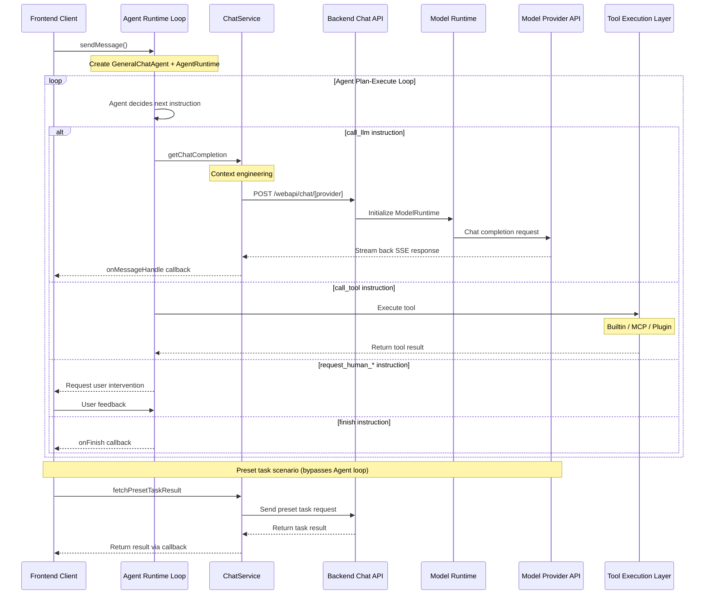

# Chat API Client-Server Interaction Logic

This document explains the implementation logic of
LobeChat Chat API in client-server interactions,
including event sequences and core components involved.

## Interaction Sequence Diagram



## Main Process Steps

### 1. Client Initiates Request

After the user sends a message, `sendMessage()`
(`src/store/chat/slices/aiChat/actions/conversationLifecycle.ts`)
creates the user message and assistant message placeholder,
then calls `internal_execAgentRuntime()`.

### 2. Agent Runtime Drives the Loop

Agent Runtime is the **core execution engine**
of the entire chat flow. Every chat interaction
(from simple Q\&A to complex multi-step tool calling)
is driven by the `AgentRuntime.step()` loop.

**Initialization**
(`src/store/chat/slices/aiChat/actions/streamingExecutor.ts`):

1. Resolve agent config (model, provider, plugin list, etc.)
2. Create the tool registry via `createAgentToolsEngine()`
3. Create `GeneralChatAgent` (the "brain" that decides
   what to do next) and `AgentRuntime` (the "engine"
   that executes instructions)
4. Inject custom executors via `createAgentExecutors()`

**Execution Loop**:

```ts
while (state.status !== 'done' && state.status !== 'error') {
  result = await runtime.step(state, nextContext);
  // GeneralChatAgent decides: call_llm → call_tool → call_llm → finish
}
```

At each step, `GeneralChatAgent` returns an
`AgentInstruction` based on current state,
and `AgentRuntime` executes it via the corresponding
executor:

- `call_llm`: Call the LLM (see steps 3-5 below)
- `call_tool`: Execute tool calls (see step 6 below)
- `finish`: End the loop
- `compress_context`: Context compression
- `request_human_approve` / `request_human_prompt` /
  `request_human_select`: Request user intervention

### 3. Frontend Processes LLM Request

When the Agent issues a `call_llm` instruction,
the executor calls ChatService:

- `src/services/chat/index.ts` preprocesses messages,
  tools, and parameters
- Modules under `src/services/chat/mecha/` perform
  context engineering, including agent config resolution,
  model parameter resolution, MCP context injection, etc.
- Calls `getChatCompletion` to prepare request parameters
- Uses `fetchSSE` from the `@lobechat/fetch-sse` package
  to send the request to the backend API

### 4. Backend Processes Request

- `src/app/(backend)/webapi/chat/[provider]/route.ts`
  receives the request
- Calls `initModelRuntimeFromDB` to read user's provider
  config from the database and initialize ModelRuntime
- A tRPC route `src/server/routers/lambda/aiChat.ts`
  also exists for server-side message sending
  and structured output scenarios

### 5. Model Call and Response Processing

- `ModelRuntime`
  (`packages/model-runtime/src/core/ModelRuntime.ts`)
  calls the respective model provider's API
  and returns a streaming response
- Frontend processes the streaming response via
  `fetchSSE` and
  [fetchEventSource](https://github.com/Azure/fetch-event-source)
- Handles different types of events
  (text, tool calls, reasoning, etc.)
- Passes results back to client through callback functions

### 6. Tool Calling Scenario

When the AI model returns a `tool_calls` field in its
response, the Agent issues a `call_tool` instruction.
LobeChat supports three types of tools:

**Builtin Tools**: Tools built into the application,
executed directly via local executors.

- Frontend executes them directly on the client
  via the `invokeBuiltinTool` method
- Includes built-in features like search,
  DALL-E image generation, etc.

**MCP Tools**: External tools connected via
[Model Context Protocol](https://modelcontextprotocol.io/).

- Frontend calls `MCPService` (`src/services/mcp.ts`)
  via the `invokeMCPTypePlugin` method
- Supports three connection modes:
  stdio, HTTP (streamable-http/SSE), and cloud (Klavis)
- MCP tool registration and discovery is managed
  through MCP server configuration

**Plugin Tools**: Legacy plugin system,
invoked via API gateway.
This system is expected to be gradually deprecated
in favor of the MCP tool system.

- Frontend calls them via the
  `invokeDefaultTypePlugin` method
- Retrieves plugin settings and manifest,
  creates authentication headers,
  and sends requests to the plugin gateway

After tool execution completes, results are written to
the message and returned to the Agent loop.
The Agent then calls the LLM again to generate
the final response based on tool results.
The tool dispatch logic is in
`src/store/chat/slices/plugin/actions/pluginTypes.ts`.

### 7. Preset Task Processing

Preset tasks are predefined functions typically triggered
when users perform specific actions
(bypassing the Agent Runtime loop, calling LLM directly).
These tasks use the `fetchPresetTaskResult` method,
which is similar to the normal chat flow
but uses specially designed prompt chains.

**Execution Timing**:

1. **Agent Information Auto-generation**: Triggered when
   users create or edit an agent
   - Agent avatar generation (via `autoPickEmoji` method)
   - Agent description generation
     (via `autocompleteAgentDescription` method)
   - Agent tag generation
     (via `autocompleteAgentTags` method)
   - Agent title generation
     (via `autocompleteAgentTitle` method)
2. **Message Translation**: Triggered when users manually
   click the translate button
   (via `translateMessage` method)
3. **Web Search**: When search is enabled but the model
   doesn't support tool calling, search functionality
   is implemented via `fetchPresetTaskResult`

**Code Examples**:

Agent avatar auto-generation implementation:

```ts
// src/features/AgentSetting/store/action.ts
autoPickEmoji: async () => {
  const { config, meta, dispatchMeta } = get();
  const systemRole = config.systemRole;

  chatService.fetchPresetTaskResult({
    onFinish: async (emoji) => {
      dispatchMeta({ type: 'update', value: { avatar: emoji } });
    },
    onLoadingChange: (loading) => {
      get().updateLoadingState('avatar', loading);
    },
    params: merge(
      get().internal_getSystemAgentForMeta(),
      chainPickEmoji(
        [meta.title, meta.description, systemRole]
          .filter(Boolean)
          .join(','),
      ),
    ),
    trace: get().getCurrentTracePayload({
      traceName: TraceNameMap.EmojiPicker,
    }),
  });
};
```

Translation feature implementation:

```ts
// src/store/chat/slices/translate/action.ts
translateMessage: async (id, targetLang) => {
  // ...omitted code...

  // Detect language
  chatService.fetchPresetTaskResult({
    onFinish: async (data) => {
      if (data && supportLocales.includes(data)) from = data;
      await updateMessageTranslate(id, {
        content,
        from,
        to: targetLang,
      });
    },
    params: merge(
      translationSetting,
      chainLangDetect(message.content),
    ),
    trace: get().getCurrentTracePayload({
      traceName: TraceNameMap.LanguageDetect,
    }),
  });

  // Perform translation
  chatService.fetchPresetTaskResult({
    onMessageHandle: (chunk) => {
      if (chunk.type === 'text') {
        content = chunk.text;
        internal_dispatchMessage({
          id,
          type: 'updateMessageTranslate',
          value: { content, from, to: targetLang },
        });
      }
    },
    onFinish: async () => {
      await updateMessageTranslate(id, {
        content,
        from,
        to: targetLang,
      });
      internal_toggleChatLoading(
        false,
        id,
        n('translateMessage(end)', { id }) as string,
      );
    },
    params: merge(
      translationSetting,
      chainTranslate(message.content, targetLang),
    ),
    trace: get().getCurrentTracePayload({
      traceName: TraceNameMap.Translation,
    }),
  });
};
```

### 8. Completion

When the Agent issues a `finish` instruction,
the loop ends, and the `onFinish` callback is called
with the complete response result.

## Client-Side vs Server-Side Execution

The Agent Runtime loop execution location
depends on the scenario:

- **Client-side loop** (browser): Regular 1:1 chat,
  continue generation, group orchestration decisions.
  The loop runs in the browser, entry point is
  `internal_execAgentRuntime()`
  (`src/store/chat/slices/aiChat/actions/streamingExecutor.ts`)
- **Server-side loop** (queue/local):
  Group chat supervisor agent, sub-agent tasks,
  API/Cron triggers. The loop runs on the server,
  streaming events to the client via SSE, entry point is
  `AgentRuntimeService.executeStep()`
  (`src/server/services/agentRuntime/AgentRuntimeService.ts`),
  tRPC route at `src/server/routers/lambda/aiAgent.ts`

## Model Runtime

Model Runtime (`packages/model-runtime/`) is the core
abstraction layer in LobeChat for interacting with
LLM model providers, adapting different provider APIs
into a unified interface.

**Core Responsibilities**:

- **Unified Abstraction Layer**: Hides differences
  between AI provider APIs through the `LobeRuntimeAI`
  interface
  (`packages/model-runtime/src/core/BaseAI.ts`)
- **Model Initialization**: Initializes the corresponding
  runtime instance through the provider mapping table
  (`packages/model-runtime/src/runtimeMap.ts`)
- **Capability Encapsulation**: `chat` (streaming chat),
  `models` (model listing), `embeddings` (text embeddings),
  `createImage` (image generation),
  `textToSpeech` (speech synthesis),
  `generateObject` (structured output)

**Core Interface**:

```ts
// packages/model-runtime/src/core/BaseAI.ts
export interface LobeRuntimeAI {
  baseURL?: string;
  chat?(
    payload: ChatStreamPayload,
    options?: ChatMethodOptions,
  ): Promise<Response>;
  generateObject?(
    payload: GenerateObjectPayload,
    options?: GenerateObjectOptions,
  ): Promise<any>;
  embeddings?(
    payload: EmbeddingsPayload,
    options?: EmbeddingsOptions,
  ): Promise<Embeddings[]>;
  models?(): Promise<any>;
  createImage?: (
    payload: CreateImagePayload,
  ) => Promise<CreateImageResponse>;
  textToSpeech?: (
    payload: TextToSpeechPayload,
    options?: TextToSpeechOptions,
  ) => Promise<ArrayBuffer>;
}
```

**Adapter Architecture**: Through two factory functions —
`openaiCompatibleFactory` and
`anthropicCompatibleFactory` — most providers can be
integrated with minimal configuration. Currently supports
over 40 model providers (OpenAI, Anthropic, Google,
Azure, Bedrock, Ollama, etc.), with implementations
in `packages/model-runtime/src/providers/`.

## Agent Runtime

Agent Runtime (`packages/agent-runtime/`) is LobeChat's
agent orchestration engine. As described above, it is the
core execution engine that drives the entire chat flow.

**Core Components**:

- **`AgentRuntime`**
  (`packages/agent-runtime/src/core/runtime.ts`):
  The "engine" that executes the Agent instruction loop,
  supporting `call_llm`, `call_tool`, `finish`,
  `compress_context`, `request_human_*`, etc.
- **`GeneralChatAgent`**
  (`packages/agent-runtime/src/agents/GeneralChatAgent.ts`):
  The "brain" that decides which instruction to execute
  next based on current state
- **`GroupOrchestrationRuntime`**
  (`packages/agent-runtime/src/groupOrchestration/`):
  Multi-agent orchestration supporting speak / broadcast /
  delegate / executeTask collaboration modes
- **`UsageCounter`**: Token usage and cost tracking
- **`InterventionChecker`**:
  Security blacklist for managing agent behavior boundaries
