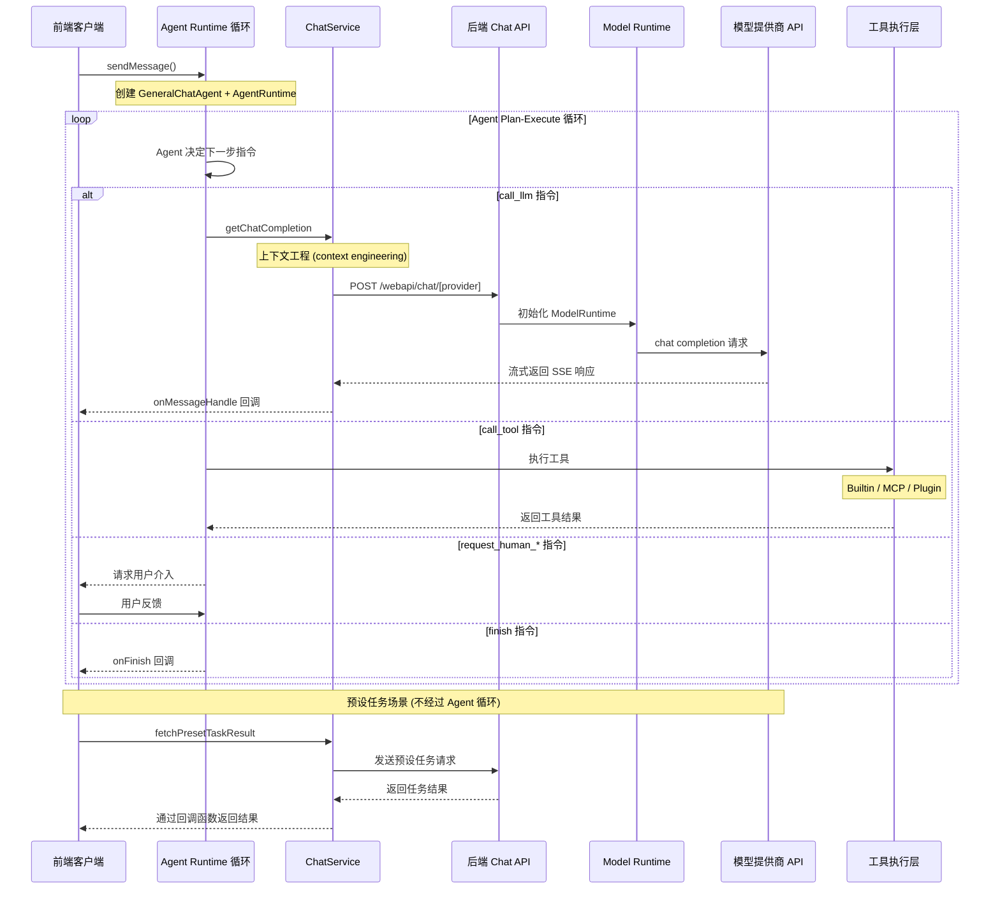

# Chat API 前后端交互逻辑

本文档说明了 LobeChat Chat API 在前后端交互中的实现逻辑，
包括事件序列和涉及的核心组件。

## 交互时序图



## 主要步骤说明

### 1. 客户端发起请求

用户发送消息后，`sendMessage()`
（`src/store/chat/slices/aiChat/actions/conversationLifecycle.ts`）
创建用户消息和助手消息占位，然后调用 `internal_execAgentRuntime()`。

### 2. Agent Runtime 驱动循环

Agent Runtime 是整个 chat 流程的**核心执行引擎**。
每次聊天交互（从简单问答到复杂多步工具调用）都通过
`AgentRuntime.step()` 循环驱动。

**初始化**
（`src/store/chat/slices/aiChat/actions/streamingExecutor.ts`）：

1. 解析 agent 配置（模型、provider、插件列表等）
2. 通过 `createAgentToolsEngine()` 创建工具注册表
3. 创建 `GeneralChatAgent`（"大脑"，决定下一步做什么）
   和 `AgentRuntime`（"引擎"，执行指令）
4. 通过 `createAgentExecutors()` 注入自定义执行器

**执行循环**：

```ts
while (state.status !== 'done' && state.status !== 'error') {
  result = await runtime.step(state, nextContext);
  // GeneralChatAgent 决定: call_llm → call_tool → call_llm → finish
}
```

每一步中，`GeneralChatAgent` 根据当前状态返回一条
`AgentInstruction`，`AgentRuntime` 通过对应的 executor 执行：

- `call_llm`：调用 LLM（见下方步骤 3-5）
- `call_tool`：执行工具调用（见下方步骤 6）
- `finish`：结束循环
- `compress_context`：上下文压缩
- `request_human_approve` / `request_human_prompt` /
  `request_human_select`：请求用户介入

### 3. 前端处理 LLM 请求

当 Agent 发出 `call_llm` 指令时，executor 调用 ChatService：

- `src/services/chat/index.ts` 对消息、工具和参数进行预处理
- `src/services/chat/mecha/` 下的模块完成上下文工程
  （context engineering），包括 agent 配置解析、
  模型参数解析、MCP 上下文注入等
- 调用 `getChatCompletion` 准备请求参数
- 使用 `@lobechat/fetch-sse` 包中的 `fetchSSE`
  发送请求到后端 API

### 4. 后端处理请求

- `src/app/(backend)/webapi/chat/[provider]/route.ts` 接收请求
- 调用 `initModelRuntimeFromDB` 从数据库读取用户的
  provider 配置，初始化 ModelRuntime
- 同时存在 tRPC 路由
  `src/server/routers/lambda/aiChat.ts`，
  用于服务端消息发送和结构化输出等场景

### 5. 模型调用与响应处理

- `ModelRuntime`
  （`packages/model-runtime/src/core/ModelRuntime.ts`）
  调用相应模型提供商的 API，返回流式响应
- 前端通过 `fetchSSE` 和
  [fetchEventSource](https://github.com/Azure/fetch-event-source)
  处理流式响应
- 对不同类型的事件（文本、工具调用、推理等）进行处理
- 通过回调函数将结果传递回客户端

### 6. 工具调用场景

当 AI 模型在响应中返回 `tool_calls` 字段时，Agent 会发出
`call_tool` 指令。LobeChat 支持三种工具类型：

**Builtin 工具**：内置在应用中的工具，通过本地执行器直接运行。

- 前端通过 `invokeBuiltinTool` 方法在客户端直接执行
- 包括搜索、DALL-E 图像生成等内置功能

**MCP 工具**：通过
[Model Context Protocol](https://modelcontextprotocol.io/)
连接的外部工具。

- 前端通过 `invokeMCPTypePlugin` 方法调用
  `MCPService`（`src/services/mcp.ts`）
- 支持 stdio、HTTP（streamable-http/SSE）
  和云端（Klavis）三种连接方式
- MCP 工具的注册和发现通过 MCP 服务器配置管理

**Plugin 工具**：传统插件体系，通过 API 网关调用。
该体系预期将逐步废弃，由 MCP 工具体系替代。

- 前端通过 `invokeDefaultTypePlugin` 方法调用
- 获取插件设置和清单、创建认证请求头、
  发送请求到插件网关

工具执行完成后，结果写入消息并返回给 Agent 循环，
Agent 会再次调用 LLM 基于工具结果生成最终响应。
工具分发逻辑位于
`src/store/chat/slices/plugin/actions/pluginTypes.ts`。

### 7. 预设任务处理

预设任务是系统预定义的特定功能任务，
通常在用户执行特定操作时触发
（不经过 Agent Runtime 循环，直接调用 LLM）。
这些任务使用 `fetchPresetTaskResult` 方法执行，
该方法与正常聊天流程类似，
但会使用专门设计的提示词（prompt chain）。

**执行时机**：

1. **角色信息自动生成**：当用户创建或编辑角色时触发
   - 角色头像生成（通过 `autoPickEmoji` 方法）
   - 角色描述生成（通过 `autocompleteAgentDescription` 方法）
   - 角色标签生成（通过 `autocompleteAgentTags` 方法）
   - 角色标题生成（通过 `autocompleteAgentTitle` 方法）
2. **消息翻译**：用户手动点击翻译按钮时触发
   （通过 `translateMessage` 方法）
3. **网页搜索**：当启用搜索但模型不支持工具调用时，
   通过 `fetchPresetTaskResult` 实现搜索功能

**实际代码示例**：

角色头像自动生成实现：

```ts
// src/features/AgentSetting/store/action.ts
autoPickEmoji: async () => {
  const { config, meta, dispatchMeta } = get();
  const systemRole = config.systemRole;

  chatService.fetchPresetTaskResult({
    onFinish: async (emoji) => {
      dispatchMeta({ type: 'update', value: { avatar: emoji } });
    },
    onLoadingChange: (loading) => {
      get().updateLoadingState('avatar', loading);
    },
    params: merge(
      get().internal_getSystemAgentForMeta(),
      chainPickEmoji(
        [meta.title, meta.description, systemRole]
          .filter(Boolean)
          .join(','),
      ),
    ),
    trace: get().getCurrentTracePayload({
      traceName: TraceNameMap.EmojiPicker,
    }),
  });
};
```

翻译功能实现：

```ts
// src/store/chat/slices/translate/action.ts
translateMessage: async (id, targetLang) => {
  // ...省略部分代码...

  // 检测语言
  chatService.fetchPresetTaskResult({
    onFinish: async (data) => {
      if (data && supportLocales.includes(data)) from = data;
      await updateMessageTranslate(id, {
        content,
        from,
        to: targetLang,
      });
    },
    params: merge(
      translationSetting,
      chainLangDetect(message.content),
    ),
    trace: get().getCurrentTracePayload({
      traceName: TraceNameMap.LanguageDetect,
    }),
  });

  // 执行翻译
  chatService.fetchPresetTaskResult({
    onMessageHandle: (chunk) => {
      if (chunk.type === 'text') {
        content = chunk.text;
        internal_dispatchMessage({
          id,
          type: 'updateMessageTranslate',
          value: { content, from, to: targetLang },
        });
      }
    },
    onFinish: async () => {
      await updateMessageTranslate(id, {
        content,
        from,
        to: targetLang,
      });
      internal_toggleChatLoading(
        false,
        id,
        n('translateMessage(end)', { id }) as string,
      );
    },
    params: merge(
      translationSetting,
      chainTranslate(message.content, targetLang),
    ),
    trace: get().getCurrentTracePayload({
      traceName: TraceNameMap.Translation,
    }),
  });
};
```

### 8. 完成

当 Agent 发出 `finish` 指令时，循环结束，
调用 `onFinish` 回调，提供完整的响应结果。

## 客户端 vs 服务端执行

Agent Runtime 循环的执行位置取决于场景：

- **客户端循环**（浏览器）：常规 1:1 对话、继续生成、
  群组编排决策。循环在浏览器中运行，
  入口为 `internal_execAgentRuntime()`
  （`src/store/chat/slices/aiChat/actions/streamingExecutor.ts`）
- **服务端循环**（队列 / 本地）：群聊 supervisor agent、
  子 agent 任务、API/Cron 触发。循环在服务端运行，
  通过 SSE 流式推送事件到客户端，
  入口为 `AgentRuntimeService.executeStep()`
  （`src/server/services/agentRuntime/AgentRuntimeService.ts`），
  tRPC 路由为 `src/server/routers/lambda/aiAgent.ts`

## Model Runtime

Model Runtime（`packages/model-runtime/`）是 LobeChat 中
与 LLM 模型提供商交互的核心抽象层，
负责将不同提供商的 API 适配为统一接口。

**核心职责**：

- **统一抽象层**：通过 `LobeRuntimeAI` 接口
  （`packages/model-runtime/src/core/BaseAI.ts`）
  隐藏不同 AI 提供商 API 的差异
- **模型初始化**：通过 provider 映射表
  （`packages/model-runtime/src/runtimeMap.ts`）
  初始化对应的运行时实例
- **能力封装**：`chat`（聊天流式请求）、
  `models`（模型列表）、`embeddings`（文本嵌入）、
  `createImage`（图像生成）、`textToSpeech`（语音合成）、
  `generateObject`（结构化输出）

**核心接口**：

```ts
// packages/model-runtime/src/core/BaseAI.ts
export interface LobeRuntimeAI {
  baseURL?: string;
  chat?(
    payload: ChatStreamPayload,
    options?: ChatMethodOptions,
  ): Promise<Response>;
  generateObject?(
    payload: GenerateObjectPayload,
    options?: GenerateObjectOptions,
  ): Promise<any>;
  embeddings?(
    payload: EmbeddingsPayload,
    options?: EmbeddingsOptions,
  ): Promise<Embeddings[]>;
  models?(): Promise<any>;
  createImage?: (
    payload: CreateImagePayload,
  ) => Promise<CreateImageResponse>;
  textToSpeech?: (
    payload: TextToSpeechPayload,
    options?: TextToSpeechOptions,
  ) => Promise<ArrayBuffer>;
}
```

**适配器架构**：通过 `openaiCompatibleFactory` 和
`anthropicCompatibleFactory` 两种工厂函数，
大多数提供商只需少量配置即可接入。
目前支持超过 40 个模型提供商
（OpenAI、Anthropic、Google、Azure、Bedrock、Ollama 等），
各实现位于 `packages/model-runtime/src/providers/`。

## Agent Runtime

Agent Runtime（`packages/agent-runtime/`）是
LobeChat 的 Agent 编排引擎。
如上文所述，它是驱动整个 chat 流程的核心执行引擎。

**核心组件**：

- **`AgentRuntime`**
  （`packages/agent-runtime/src/core/runtime.ts`）：
  "引擎"，执行 Agent 指令循环，
  支持 `call_llm`、`call_tool`、`finish`、
  `compress_context`、`request_human_*` 等指令类型
- **`GeneralChatAgent`**
  （`packages/agent-runtime/src/agents/GeneralChatAgent.ts`）：
  "大脑"，根据当前状态决定下一步执行什么指令
- **`GroupOrchestrationRuntime`**
  （`packages/agent-runtime/src/groupOrchestration/`）：
  多 Agent 编排，支持 speak /broadcast/
  delegate /executeTask 等协作模式
- **`UsageCounter`**：token 使用和费用追踪
- **`InterventionChecker`**：
  安全黑名单管理 Agent 行为边界
