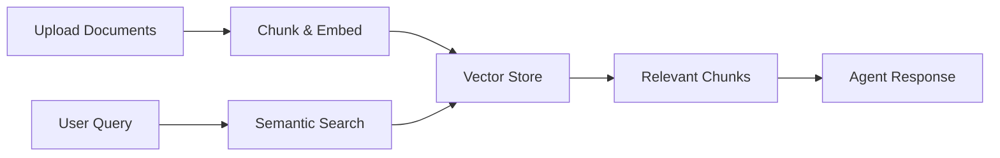

# Resource Library

The Resource Library is your personal knowledge hub. Documents uploaded in conversations, AI-generated images, and drafts you create — all collected here. Centralize your knowledge so Agents can answer from your data, not just from general training. Manage and access everything in one place.

## Overview

The Resource Library provides:

- **Semantic Search**: Vector-based search that understands meaning, not just keywords
- **Document Retrieval**: Agents read and reference your uploaded files
- **Multiple Formats**: Support for documents, images, audio, video, and more
- **Persistent Storage**: Knowledge persists across conversations
- **Chunked Processing**: Large documents split into searchable chunks

## How It Works



<Steps>
  ### Upload Documents

  Upload files to your Resource Library through direct upload, conversation uploads, or Notion import.

  ### Embedding Process

  Documents are:

  1. Split into manageable chunks
  2. Converted to vector embeddings
  3. Stored in the vector database
  4. Associated with metadata (filename, chunk position)

  ### Semantic Search

  When queried, the system:

  1. Converts your query to a vector embedding
  2. Finds the most similar chunks via cosine similarity
  3. Returns files and excerpts ranked by relevance

  ### Agent Response

  The Agent reads the most relevant chunks and incorporates them into its response — finding content even when the exact words don't match. For example, searching "how to login" can find content about "authentication" or "sign in".
</Steps>

## Where Resources Come From

- **Conversation uploads** — Files uploaded during chats are automatically saved to the Resource Library. Upload a PDF for summarization, and it stays available for future use.
- **AI-generated content** — Images created in the Drawing module are saved automatically. View, download, and reuse them in conversations or drafts anytime.
- **Manual uploads** — Upload files or folders directly to build your knowledge base. Supported formats: documents, images, video, audio, and more.
- **Drafts** — Pages created in the writing module are stored here for unified management.
- **Notion import** — Import content from Notion into LobeHub for seamless knowledge management across platforms.

**Access the Resource Library** — Click the **Resources** icon at the bottom of the left sidebar on the LobeHub main interface.

## Creating a Resource Library

Organize your resources by theme, project, or type. Separate libraries keep everything structured.

Click **New Library** in the left panel of the Resource Library page, enter a name, add an optional description, and click **Create**.


### Uploading Folders

Choose to upload a folder to batch upload all files within it.

### Connecting Notion

Export documents from Notion, then import the Notion ZIP file via the **Connect Notion** page. Once imported, you can continue editing these documents within LobeHub.


## Search Best Practices

### Resolve References

Knowledge Base uses vector-based semantic search. Always resolve pronouns and references to concrete entities.

- ❌ "What does it do?" / "Tell me about that" / "How does this work?"
- ✅ "What does the authentication system do?" / "How does the payment processing workflow work?"

**Why?** Vector search works by semantic similarity. Pronouns like "it" or "that" have no semantic meaning on their own and produce poor results.

### Query Formulation

<AccordionGroup>
  <Accordion title="Be Specific">
    Use precise terminology and context:

    - "user authentication with OAuth 2.0" ✅
    - "login stuff" ❌
  </Accordion>

  <Accordion title="Include Context">
    Add relevant details to narrow scope:

    - "React component testing with Jest" ✅
    - "testing" ❌
  </Accordion>

  <Accordion title="Use Full Names">
    Expand abbreviations on first search:

    - "JSON Web Token authentication" ✅
    - "JWT auth" (use after establishing context) ✅
  </Accordion>

  <Accordion title="Natural Language">
    Write queries as complete questions or phrases:

    - "How to implement password reset functionality" ✅
    - "password reset how" ❌
  </Accordion>
</AccordionGroup>

## Workflow Strategies

### Two-Step Search Pattern

The recommended approach for getting the best results:

1. **Search first** — Use semantic search to discover relevant files and review the excerpts
2. **Read selected files** — Retrieve the full content from the most relevant results

This gives the Agent complete context to answer your question accurately.

### Iterative Refinement

For complex queries, search multiple times with different phrasings:

1. Start with a broad initial search ("payment processing system")
2. Refine based on results ("payment processing error handling and retries")
3. Read the most relevant files from combined results

### Batch Reading

When a topic spans multiple files, read several related files at once to give the Agent comprehensive context.

## Managing the Resource Library

**File chunking** — Long documents are split into smaller text segments and vectorized. This helps the Agent understand and retrieve relevant content more accurately.

After chunking:

- When you ask a question, the Agent quickly locates the relevant parts instead of processing the entire file
- Vectorization lets the Agent grasp semantic meaning, not just match keywords
- The Agent processes only relevant chunks — faster and more accurate responses

### Batch Operations

Select multiple files and open the menu in the top-right corner to perform batch operations: move files to a library, chunk, or delete in bulk.


### Supported File Formats and Limits

**Supported formats:**

- Documents: PDF, Word (.docx), PowerPoint (.pptx), Excel (.xlsx), Markdown, plain text (.txt)
- Code: Most programming languages
- Data: CSV, JSON, XML, HTML
- Images: JPEG, PNG, GIF, WebP, SVG
- Audio: MP3, WAV, M4A, FLAC
- Video: MP4, MOV, WebM

File size limit is typically 50 MB per file. For very large documents, consider splitting them before uploading for better search performance.

### File Organization

- Use clear, descriptive filenames
- Organize by topic or category
- Keep files updated and remove outdated ones
- Use version numbers for evolving docs
- Break large documents into focused files

## Advanced Features

### Relevance Scoring

Search results include relevance scores (0–1). Scores above 0.85 indicate a strong match, 0.7–0.85 indicate moderate relevance worth reviewing, and below 0.7 may not be useful.

### Excerpt Preview

Search results include brief excerpts from matched chunks. Review these before reading full files — often the excerpt contains enough information.

### Citation & Attribution

When Agents use your knowledge base, best practices include:

- Reference specific files by name
- Include section/page numbers when available
- Quote directly for critical information
- Indicate when synthesizing across multiple sources

### System Prompt Integration

Guide knowledge base usage in your Agent's system prompt:

```
You are a customer support agent with access to our product documentation.

When answering product questions:
1. Always search the knowledge base first
2. Cite specific documents in your responses
3. If unsure, read the full document for context
4. If you can't find info, let the user know
```

## Cross-Feature Collaboration

- **Chat + Resource Library** — Reference resources during conversations so the Agent answers from your knowledge
- **Pages + Resource Library** — Use materials from the Resource Library while writing to enhance content creation
- **Drawing + Resource Library** — Save generated images to the Resource Library for centralized management of visual assets

## Use Cases

- **Technical documentation** — Upload API docs, guides, or specs and ask questions in natural language
- **Company knowledge** — Centralize onboarding materials, policies, and wikis for Agent-assisted retrieval
- **Customer support** — Upload FAQs and product documentation to power accurate support responses
- **Research** — Collect papers and articles and let the Agent synthesize findings across sources
- **Code documentation** — Store architecture docs and code guides to help developers understand codebases

## Troubleshooting

<AccordionGroup>
  <Accordion title="No Search Results">
    **Solutions**:

    - Verify documents are uploaded and processed (chunked)
    - Rephrase query with different terminology
    - Use broader, more general search terms
    - Check if topic is covered in uploaded docs
    - Resolve pronouns to concrete entity names
  </Accordion>

  <Accordion title="Poor Relevance">
    **Solutions**:

    - Reformulate query with more context
    - Try multiple related queries
    - Verify document quality and format
    - Check if chunking is appropriate
    - Use full entity names instead of pronouns
  </Accordion>

  <Accordion title="Slow Performance">
    **Solutions**:

    - Break large documents into focused files
    - Remove outdated or irrelevant files
    - Use specific queries to reduce search scope
    - Read only the most relevant files instead of all results
  </Accordion>
</AccordionGroup>

<Cards>
  <Card href={'/docs/usage/getting-started/agent'} title={'Agent'} />

  <Card href={'/docs/usage/getting-started/page'} title={'Pages'} />

  <Card href={'/docs/usage/getting-started/generation'} title={'Image & Video Generation'} />
</Cards>
